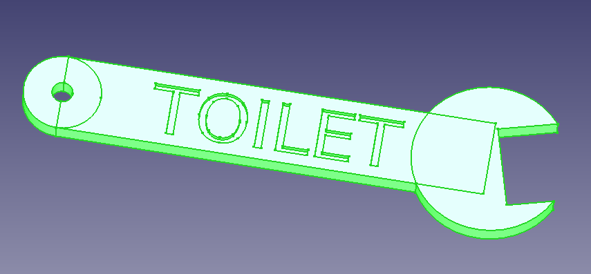
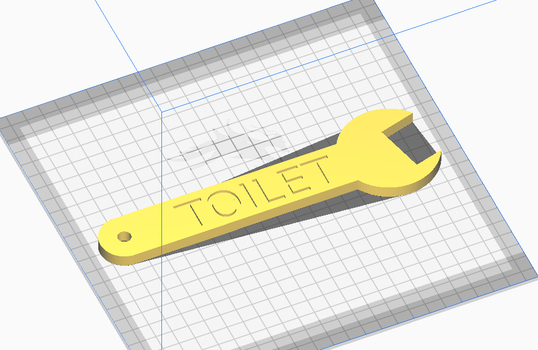

# Oversized "TOILET" Keyring for Workshops & Garages

This is a large, spanner-shaped keyring designed specifically for the essential keys that always seem to go missing in a busy shared environment like a garage or workshop. Clearly and humorously labeled "TOILET," this keyring is a practical and robust solution to a common problem.

## The Problem:
In a busy garage, keys for common areas like the restroom are handled by many different people throughout the day. Standard-sized keys are small, easily forgotten, and can accidentally slip into a pocket and be taken home. This leads to frustrating searches, wasted time, and the potential need to cut new keys.

## The Solution:
This oversized keyring is designed with a simple but effective principle in mind: make it impossible to forget and awkward to pocket.

* Large and Unwieldy: At 18cm (approx. 7 inches) long, the keyring is substantial. Its size and shape make it immediately noticeable and uncomfortable to put in a pocket, strongly encouraging users to return it to its designated hook immediately after use.

* Clear Identification: The large, debossed text "TOILET" instantly identifies the key's purpose, avoiding confusion with other vehicle or tool-chest keys.

* Robust and Thematic Design: The spanner shape is a perfect fit for a garage or workshop environment. It's a fun, thematic design that is also highly durable when 3D printed with standard materials like PLA or PETG.

* Easy to 3D Print: The model is a single, solid piece designed to be printed flat on the bed of any standard 3D printer (20x20cm or larger) without needing complex supports.

This isn't just a keyring; it's a practical key management solution. By making the key difficult to lose, you ensure it's always available when needed, saving everyone time and hassle.

## Files

- Sliced gcode file ready for printing on an Ender 3 [CE3_SpannerKeyring-Spanner_Keyring.gcode](CE3_SpannerKeyring-Spanner_Keyring.gcode)
- STL model [SpannerKeyring-Spanner_Keyring.stl](SpannerKeyring-Spanner_Keyring.stl)
- FreeCAD file [SpannerKeyring.FCStd](SpannerKeyring.FCStd)
- Python Macro for FreeCAD [SpannerKeyring-Spanner_Keyring.py](SpannerKeyring-Spanner_Keyring.py)

## How to Use the Script in FreeCAD:

1. Open FreeCAD.

2. Switch to the "Macro" menu.

3. Select "Macros..."

4. In the dialog box, click "Create".

5. Enter a name for the macro, for example, "SpannerKeyring", and click "OK".

6. A new tab will open with a blank Python script.

7. Copy the Python code below and paste it into the script editor.

8. Click Macro, then "Execute Macro" (green play button) icon to run the script or press Ctrl + F6.

9. The spanner keyring will be generated in the 3D view.

