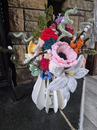

I designed and 3D printed a snap-together puzzle vase that holds 21 flowers. It's made from 15 interlocking pieces — no glue or tools needed — and can be printed in any colour to match your decor. Perfect for displaying Lego flowers, crochet flowers, or artificial blooms.

<!-- truncate -->

Standing 19 cm tall, the vase features 21 holes arranged in concentric circles that keep each stem evenly spaced and upright. The whole thing was designed in FreeCAD, with the hole layout generated programmatically using a Python macro.

## Read more

[3D Printed Puzzle Vase for Flowers](../docs/freecad/3d-printed-puzzle-vase-for-flowers/)

## Download the model

- [Thingiverse](https://www.thingiverse.com/thing:7295899)
- [Printables](https://www.printables.com/model/1602040-puzzle-vase-for-flowers-ideal-for-lego-crochet-and)
