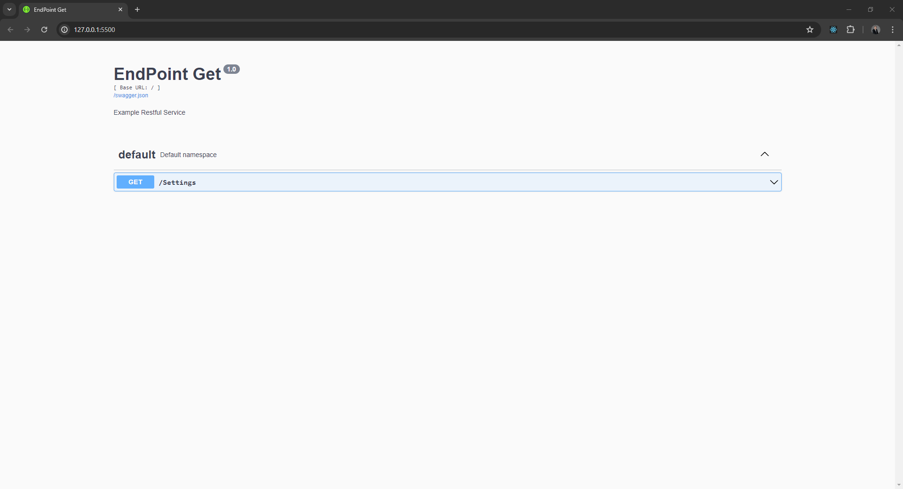
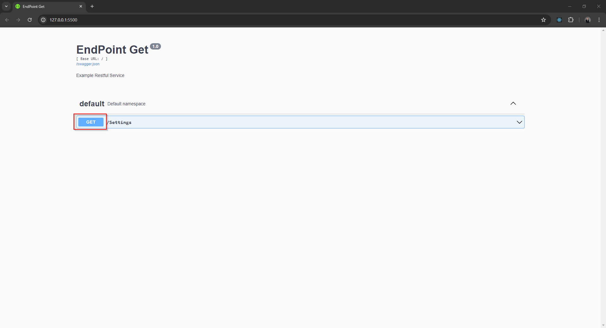
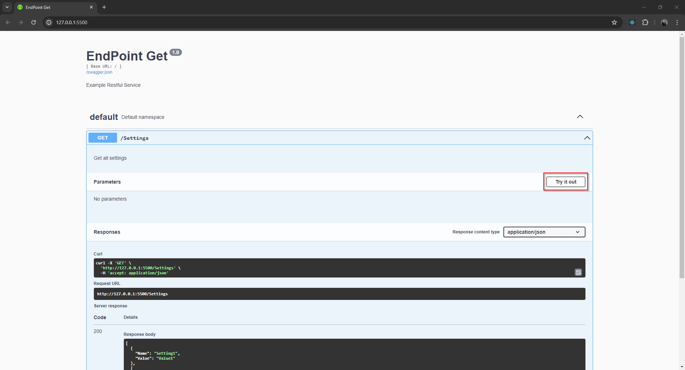
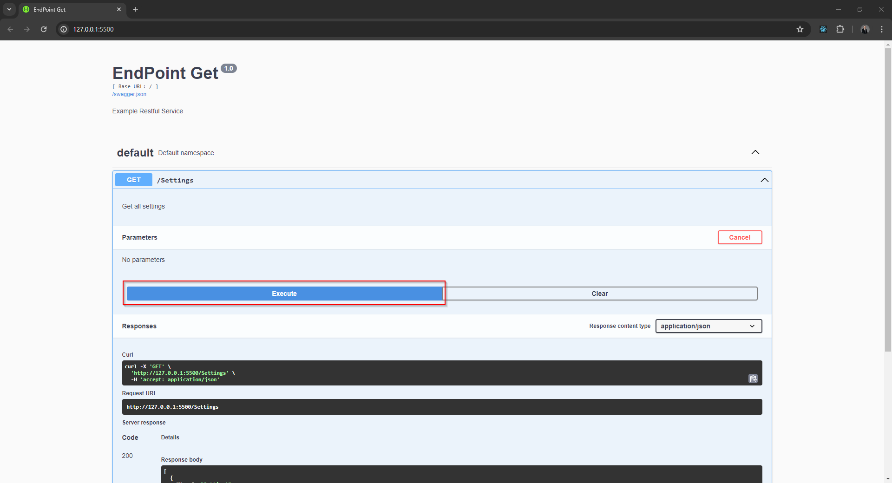
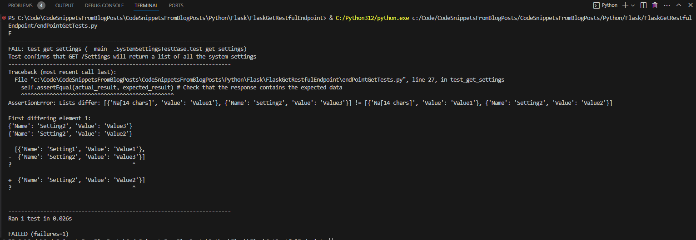

+++
title = 'How To Unit Test a Flask Restful Get Endpoint Using Python'
date = 2024-06-01T21:59:04+01:00
draft = false
tags=['programming', 'code', 'python', 'python3', 'flask', 'flask_restx']
+++

In this article, we are going to explore how to unit test a simple GET restful endpoint using Python 3 and the modules Flask, Flask_restx, and UnitTest.

## Creating The Application

First, we are going to create a simple flask application, the application will host a GET endpoint called */Settings* that returns a list of setting names and values in JSON format.

- Create a text file called `endPointGet.py` and add the following code.

```python
from flask import Flask
from flask_restx import Namespace, Resource, Api, fields, reqparse
from flask_cors import CORS

app = Flask(__name__)
CORS(app)  # Allow CORS for all routes
api = Api(app, version='1.0', title='EndPoint Get', description='Example Restful Service')

mySettingsData = [
            {'Name': 'Setting1', 'Value': 'Value1'},
            {'Name': 'Setting2', 'Value': 'Value2'}
        ]

@api.route('/Settings', doc={"description": "Get all settings"})
class GetSettings(Resource):
    def get(self):
        return mySettingsData
        
if __name__ == '__main__':
    app.run(host='0.0.0.0', port=5500, debug=False)
```

## Running The Application

To run the application:

- From the terminal execute the python file.
`python endPointGet.py`


- Open a web browser and navigate to http://127.0.0.1:5500, the page will show the swagger document for the Flask application.


- Click *default* to expand the list of endpoints

- Click the *GET* button next to /Settings.


- Click the *Try it out* button.


- Click the *Execute* button.


- The response to the request will be displayed in the *response body* section.


## Unit Testing The Application

To unit test the flask application:

- Create a text file called endPointGetTests.py and add the following code

```python
import unittest
import json
from endPointGet import *

class SystemSettingsTestCase(unittest.TestCase):
    def setUp(self):
        """Set up for unit tests, function is executed before tests begin"""

        self.client = app.test_client()
        app.config['TESTING'] = True

    def test_get_settings(self):
        """Test confirms that GET /Settings will return a list of all the system settings"""

        # Arrange 
        expected_result = [
            {'Name': 'Setting1', 'Value': 'Value1'},
            {'Name': 'Setting2', 'Value': 'Value2'}
        ]

        # Act
        response = self.client.get('/Settings') # Make a GET request to the /Settings endpoint

        # Assert
        self.assertEqual(response.status_code, 200) # Check that the response status code is 200 OK
        actual_result = json.loads(response.data) # Parse the JSON response        
        self.assertEqual(actual_result, expected_result) # Check that the response contains the expected data

if __name__ == '__main__':
    unittest.main()
```

- To run the test, execute the Python file endPointGetTests.py from the terminal.

`python endPointGetTests.py`

- The log messages from a successful test will end with *OK*.


- The log messages from a failed test will end with the number of failures.
