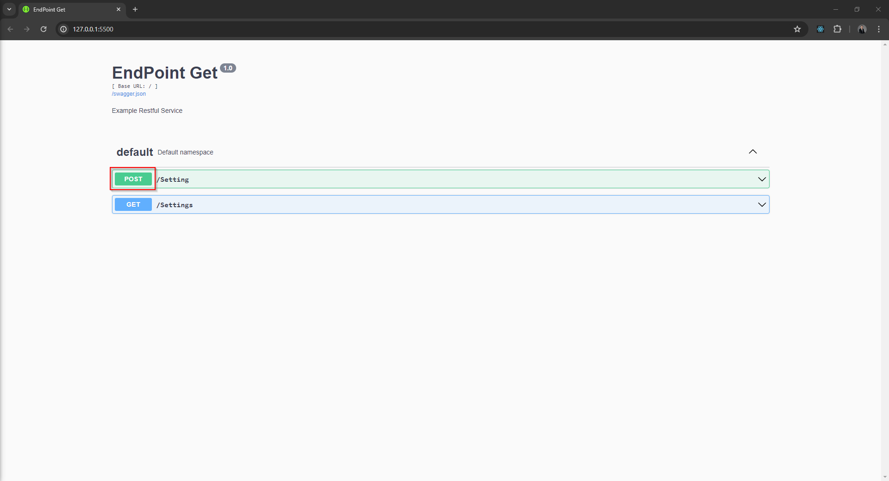
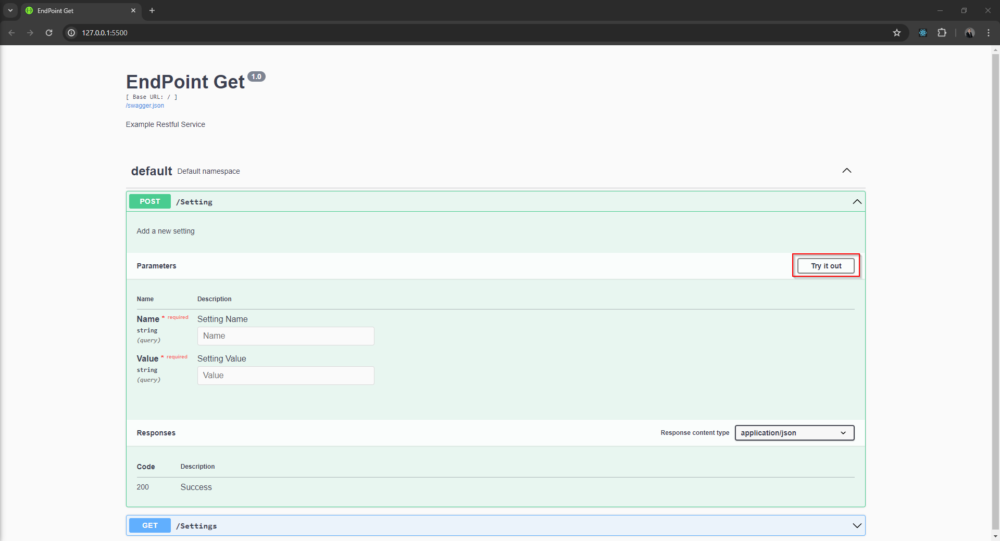
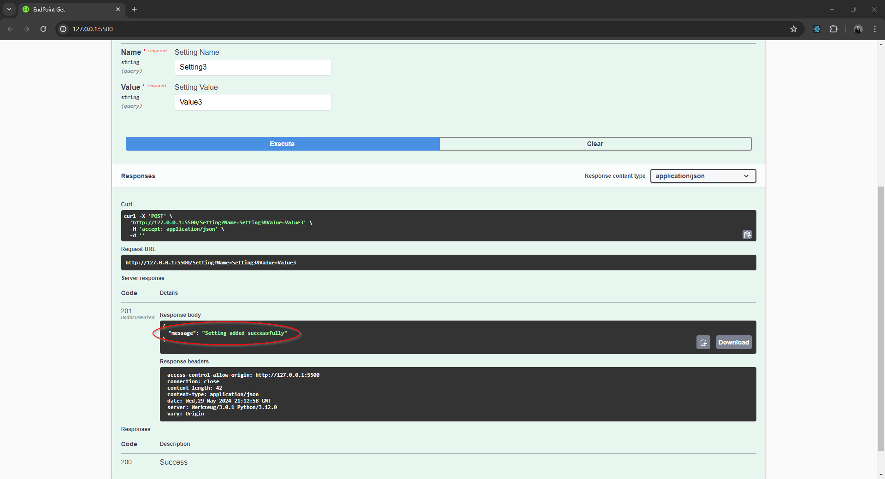
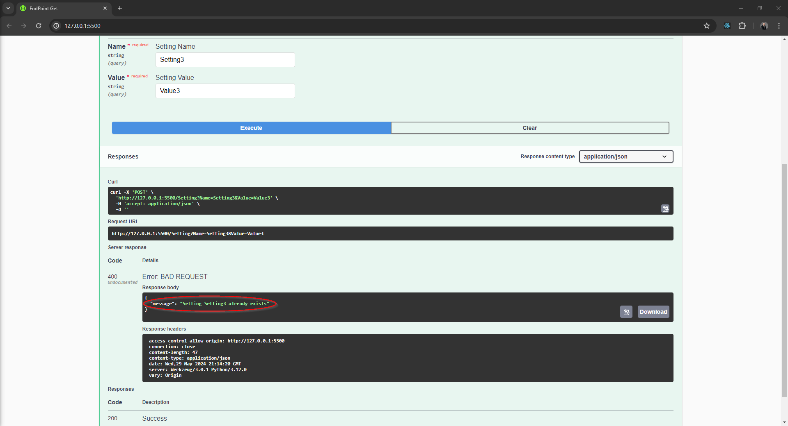

+++
title = 'How To Unit Test a Flask Restful Post Endpoint Using Python'
date = 2024-06-01T21:59:04+01:00
draft = false
tags=['programming', 'code', 'python', 'python3', 'flask', 'flask_restx']
+++

In this article, we are going to explore how to unit test a simple POST restful endpoint using Python 3 and the modules Flask, Flask_restx, and UnitTest.

## Creating The Application

First, we are going to create a simple flask application, the application will host a POST endpoint called */Setting* that will allow for a new setting value to be posted.

- Create a text file called `endPointPost.py` and add the following code.

```python
from flask import Flask
from flask_restx import Resource, Api, reqparse
from flask_cors import CORS

app = Flask(__name__)
CORS(app)  # Allow CORS for all routes
api = Api(app, version='1.0', title='EndPoint Get', description='Example Restful Service')

SettingName = 'Name'
SettingValue = 'Value'

parserAdd = reqparse.RequestParser()
parserAdd.add_argument(SettingName, type=str, help='Setting Name', required=True)
parserAdd.add_argument(SettingValue, type=str, help='Setting Value', required=True)

mySettingsData = [
            {'Name': 'Setting1', 'Value': 'Value1'},
            {'Name': 'Setting2', 'Value': 'Value2'}
        ]

def getSettingValue(sname):
    for setting in mySettingsData:
        if setting[SettingName] == sname:
            return setting[SettingValue]
    return None

@api.route('/Settings', doc={"description": "Get all settings"})
class GetSettings(Resource):
    def get(self):
        return mySettingsData

@api.route('/Setting', doc={"description": "Add a new setting"})
class AddSetting(Resource):
    @api.doc(parser=parserAdd)
    def post(self):
        args = parserAdd.parse_args()
        sname = args[SettingName]
        svalue = args[SettingValue]
        
        if getSettingValue(sname) != None:
            return {'message': f'Setting {sname} already exists'}, 400
        
        mySettingsData.append({SettingName: sname, SettingValue: svalue})
        return {'message': 'Setting added successfully'}, 201
        
if __name__ == '__main__':
    app.run(host='0.0.0.0', port=5500, debug=False)
```

## Running The Application

To run the application:

- From the terminal execute the python file.
`python endPointGet.py`


- Open a web browser and navigate to http://127.0.0.1:5500, the page will show the swagger document for the Flask application.

- Click *default* to expand the list of endpoints


- Click the *POST* button next to /Setting.


- Click the *Try it out* button.


- Enter a setting name, value, and click the *Execute* button.


- The response body should confirm the new setting has been added.


- Clicking the *Execute* button a second time will result in the error code 400, the setting already exists.


## Unit Testing The Application

The unit tests will check multiple scenarios when the setting name exists and when the setting name does not exist. 

To unit test the flask application:

- Create a text file called endPointPostTests.py and add the following code.

```python
import unittest
import json
from endPointPost import *

class SystemSettingsTestCase(unittest.TestCase):
    def setUp(self):
        """Set up for unit tests, function is executed before tests begin"""

        self.client = app.test_client()
        app.config['TESTING'] = True

    def test_get_settings(self):
        """Test confirms that GET /Settings will return a list of all the system settings"""

        # Arrange 
        expected_result = [
            {'Name': 'Setting1', 'Value': 'Value1'},
            {'Name': 'Setting2', 'Value': 'Value2'}
        ]

        # Act
        response = self.client.get('/Settings') # Make a GET request to the /Settings endpoint

        # Assert
        self.assertEqual(response.status_code, 200) # Check that the response status code is 200 OK
        actual_result = json.loads(response.data) # Parse the JSON response        
        self.assertEqual(actual_result, expected_result) # Check that the response contains the expected data
    
    def test_post_setting(self):
        """Test confirms that POST /Setting will add a new setting"""
        
        # Arrange 
        expected_result = [
            {'Name': 'Setting1', 'Value': 'Value1'},
            {'Name': 'Setting2', 'Value': 'Value2'},
            {'Name': 'Setting3', 'Value': 'Value3'}
        ]

        # Act
        response = self.client.post('/Setting', json={"Name":"Setting3", "Value":"Value3"}) # Make a POST request to the /Setting endpoint

        # Assert
        print("post response", response)
        self.assertEqual(response.status_code, 201) # Check that the response status code is 201 CREATED
        response = self.client.get('/Settings') # Make a GET request to the /Settings endpoint to get all settings which should include the new setting
        actual_result = json.loads(response.data) # Parse the JSON response        
        self.assertEqual(actual_result, expected_result) # Check that the response contains the old settings and the new setting
    
    def test_post_setting_no_post_data(self):
        """Test confirms that POST /Setting will return 415 when post request does not contain the json data"""
        
        # Arrange 

        # Act
        response = self.client.post('/Setting') # Make a POST request to the /Setting endpoint without json data

        # Assert
        self.assertEqual(response.status_code, 400) # Check that the response status code is 415
        self.assertEqual(response.status, '400 BAD REQUEST') # Check the response status message   

    def test_post_setting_bad_post_data(self):
        """Test confirms that POST /Setting will return 415 when post request contain bad json data"""
        
        # Arrange 
        badJsonData = {'Bad':'bob1'} # Json data should include Name and Value
        expected_message = f'Input payload validation failed'

        # Act
        response = self.client.post('/Setting', json=badJsonData) # Make a POST request to the /Setting endpoint with bad json data

        # Assert
        self.assertEqual(response.status_code, 400) # Check that the response status code is 400
        self.assertEqual(response.status, '400 BAD REQUEST') # Check the response status message        
        response_json = response.get_json() # Extract the JSON data from the response    
        self.assertIn('message', response_json) # Ensure the 'message' key is in the response
        self.assertEqual(response_json['message'], expected_message) # Check that the response message contains the expected message
    
    def test_post_setting_exists_post_data(self):
        """Test confirms that POST /Setting will return 400 when setting already exists"""
        
        # Arrange 
        badJsonData = {"Name":"Setting1", "Value":"Value10"} # Json data contains an already exisiting setting name
        expected_message = f'Setting Setting1 already exists'

        # Act
        response = self.client.post('/Setting', json=badJsonData) # Make a POST request to the /Setting endpoint with json data

        # Assert
        self.assertEqual(response.status_code, 400) # Check that the response status code is 400
        self.assertEqual(response.status, '400 BAD REQUEST') # Check the response status message        
        response_json = response.get_json() # Extract the JSON data from the response    
        self.assertIn('message', response_json) # Ensure the 'message' key is in the response
        self.assertEqual(response_json['message'], expected_message) # Check that the response message contains the expected message
    

if __name__ == '__main__':
    unittest.main()
```

- To run the test, execute the Python file endPointPostTests.py from the terminal.

`python endPointPostTests.py`

- The log messages from a successful test will end with *OK*.
