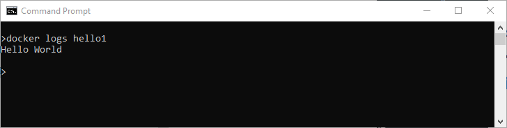

## Introduction

In this article, we are going to create a Docker Image for a .net framework console application. The Docker Image will enable us to execute the console application within a Docker Container.

## The Console Application

The console application that we will be using is called HelloWorldConsole.exe. When executed from the command line the application displays "Hello World".

[](images/image-1.png)

The application is a C# (c sharp) program that has been compiled using .net framework 4.7 and here is the source code for the application which we will be using within this article. Although in this article we will only be using the compiled application.  

```
using System;

namespace HelloWorldConsole
{
    internal class Program
    {
        static void Main()
        {
            Console.WriteLine("Hello World");
        }
    }
}
```

## Containerizing Procedure

In this procedure, we are going to create a Dockerfile. The file will describe how to create the Docker Image for the console application HelloWorldConsole.exe.

1. In the same directory as the HelloWorldConsole.exe application create a text file called **Dockerfile** no extension.

3. Using a text editor add the following code to the Dockerfile  
    `FROM mcr.microsoft.com/dotnet/framework/runtime:4.8`  
    `WORKDIR /app`  
    `COPY . .`  
    `ENTRYPOINT ["/app/HelloWorldConsole.exe"]`  
    

5. Open a command prompt and change the directory to the folder containing the Dockerfile

7. Execute the docker command to build the image file. The command will create a new docker image called helloworldconsole. Docker image names are all lowercase. The full stop (period) at the end of the command is very important as this informs the command to look for the Dockerfile in the current working directory.  
      
    `docker image build --tag helloworldconsole .`  
      
    

9. Execute the docker command to run the container using the image built in the previous step. The name argument will give set the container name to hello1 and `helloworldconsole` is the name of the image that will be used to create the container.  
      
    `docker run --name hello1 helloworldconsole`  
      
    There will be a short delay while the container boots and then the container will execute the HelloWorldConsole.exe console application.  
      
    

11. The output from the console application will be stored in the docker logs. You can review the log messages by using the docker log command with the name of the container.  
       
     docker logs hello1  
       
     

13. The container hello1 can be stopped using the cocker stop command with the name of the container. To confirm the container has stopped execute the command docker container ls command.  
       
     docker stop hello1  
       
     docker container ls  
       
       
       
     

## Summary

In this article, we created a Docker image called `helloworldconsole`. Then using the image `helloworldconsole` we created a docker container called hello1. The container executed the console application HelloWorldConsole.exe. We viewed the output of the console application using docker logs and then stopped the container using the command docker stop.


## Related Files

-   [https://github.com/seafooood/andrew-seaford.co.uk/tree/main/docs/docker/containerize-net-framework-4-8-console-application](https://github.com/seafooood/andrew-seaford.co.uk/tree/main/docs/docker/containerize-net-framework-4-8-console-application)
