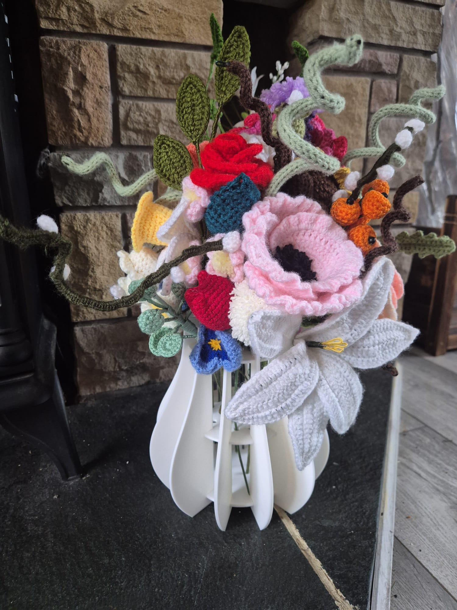
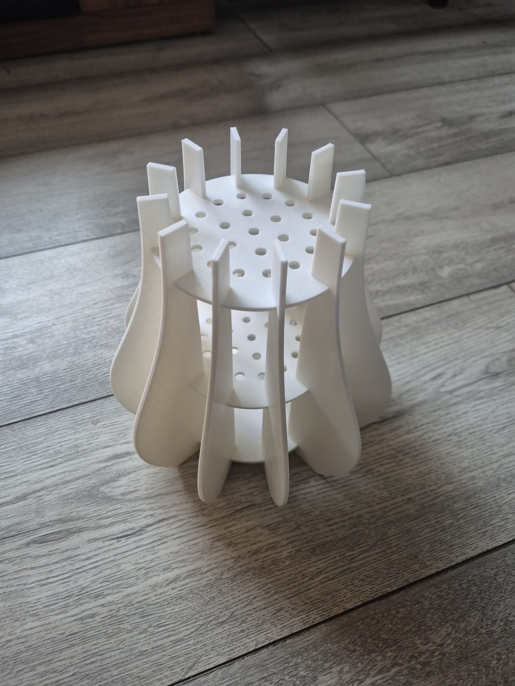
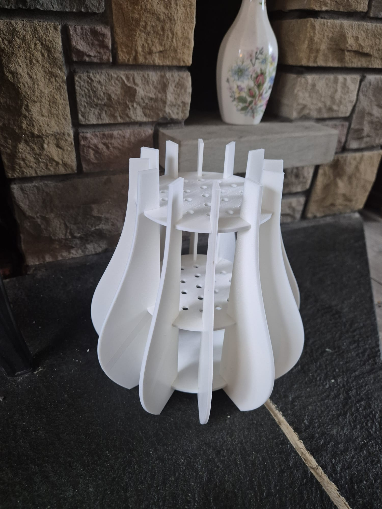

# 3D Printed Puzzle Vase for Flowers — Ideal for Lego, Crochet, and Artificial Flower Displays

## About this item

**Holds 21 Flowers with a Perfectly Balanced Layout:** This 3D printed puzzle vase accommodates up to 21 flower stems across 21 precisely placed holes arranged in concentric circles. The thoughtful layout ensures each flower is evenly spaced and held upright, creating layered, elegant arrangements every time. Whether you're displaying a full bouquet or just a few stems, the result is always beautifully balanced.

**3D Printed in Any Colour to Match Your Decor:** Unlike traditional wooden vases, this puzzle vase is 3D printed in plastic, meaning it can be produced in any colour to complement your room's colour scheme. Choose a bold accent colour to make a statement, or a subtle neutral tone to blend seamlessly into your existing decor. The smooth printed finish gives a clean, modern look that suits any style.

**Innovative Puzzle Design — 15 Pieces, No Tools Required:** Assemble your vase from 15 interlocking pieces with no glue, nails, or tools needed. The snap-fit design makes assembly quick and satisfying — simply slot the side pieces into the top and bottom disks and your vase is ready in minutes. It's a fun, hands-on project for all ages and skill levels.

**Versatile — Perfect for Lego Flowers, Crochet Flowers, and Artificial Blooms:** This vase isn't limited to one type of flower. It's ideal for displaying Lego botanical arrangements, handmade crochet flowers, or artificial blooms. Whether you're a Lego enthusiast, a crochet hobbyist, or simply looking for a stylish way to display artificial flowers, this vase has you covered.

**Stylish Home and Office Decoration:** Standing 19 cm tall, this compact yet eye-catching vase makes a stylish accent for living rooms, bedrooms, offices, and studios. Its modern puzzle design is a conversation starter and adds a creative, personal touch to any space. It also makes a thoughtful gift for flower arrangement enthusiasts, craft lovers, and anyone who appreciates unique, handmade-style decor.

## Design

The vase is made up of 15 pieces across three distinct part types, all designed in FreeCAD. The parts snap together without glue or fasteners, relying on interlocking slots for a sturdy, tool-free assembly.

### Disk With Holes (Top)

The top disk serves as both the structural hub and the flower holder. It features 15 cutouts evenly spaced around its edge, into which the side pieces slot. The centre of the disk contains 21 holes arranged in concentric circles — 6 holes in the inner ring, 9 in the middle ring, and 6 in the outer ring — each sized to hold a single flower stem upright. The hole layout was generated programmatically in FreeCAD using a Python macro to ensure precise, even spacing.

- Python Code [disk_with_holes.py](disk_with_holes.py)
- FreeCAD Macro [disk_with_holes.FCMacro](disk_with_holes.FCMacro)
- FreeCAD Design [disk_with_holes.FCStd](disk_with_holes.FCStd)
- STL [disk_with_holes.stl](disk_with_holes.stl)

### Disk Bottom (Base)

The base disk mirrors the top disk's outer profile, with 15 matching cutouts around its edge for the side pieces to slot into. It provides a flat, stable foundation for the assembled vase.

- FreeCAD Design [disk_bottom.FCStd](disk_bottom.FCStd)
- STL [disk_bottom.stl](disk_bottom.stl)

### Edge (Side Pieces)

The side pieces connect the top and bottom disks, forming the walls of the vase. Each piece slots into the cutouts on both disks, locking the structure together. 13 identical side pieces are needed to complete the vase.

- FreeCAD Design [vase_side.FCStd](vase_side.FCStd)
- STL [vase_side.stl](vase_side.stl)

## Similar Puzzle Vases On Amazon

- [Wooden Vase Compatible for Lego Flowers Bouquet, 3D Wooden Puzzle Vase with Lego Botanicals, Roses, Sunflowers, Tulips, Cherry Blossoms, Daffodils, Lotus](https://www.amazon.co.uk/dp/B0G6D8K6HZ/ref=sspa_dk_detail_4?psc=1&pd_rd_i=B0G6D8K6HZ&pd_rd_w=u83Y5&content-id=amzn1.sym.7c2bff8e-4ce3-4cc7-b3f6-35ac6c74cf9b&pf_rd_p=7c2bff8e-4ce3-4cc7-b3f6-35ac6c74cf9b&pf_rd_r=BGVBVZ6RWSTKH2DE10VK&pd_rd_wg=GCaL6&pd_rd_r=993dcffd-f85c-46ec-b200-077047f6e381&aref=q7WBDGgCY0&sp_csd=d2lkZ2V0TmFtZT1zcF9kZXRhaWw)

- [Wooden Puzzle Vase for Flowers, Ideal for Home and Office Decoration, Flower Lover's Wooden Stand for Roses, Cherry Blossoms, Sunflowers, Tulips, Daffodils ](https://www.amazon.co.uk/dp/B0DYMMT87N/ref=sspa_dk_detail_5?pd_rd_i=B0DYMMT87N&pd_rd_w=u83Y5&content-id=amzn1.sym.7c2bff8e-4ce3-4cc7-b3f6-35ac6c74cf9b&pf_rd_p=7c2bff8e-4ce3-4cc7-b3f6-35ac6c74cf9b&pf_rd_r=BGVBVZ6RWSTKH2DE10VK&pd_rd_wg=GCaL6&pd_rd_r=993dcffd-f85c-46ec-b200-077047f6e381&aref=N8lQ1DGw6p&sp_csd=d2lkZ2V0TmFtZT1zcF9kZXRhaWw&th=1)