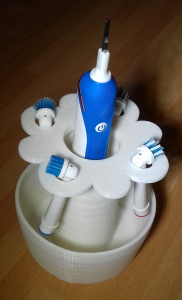

You can download the stl model from [https://pinshape.com/items/29735-3d-printed-toothbrush-flower-holder](https://pinshape.com/items/29735-3d-printed-toothbrush-flower-holder)

## Related Files

-   [https://github.com/seafooood/andrew-seaford.co.uk/tree/main/docs/freecad/3d-printed-toothbrush-holder](https://github.com/seafooood/andrew-seaford.co.uk/tree/main/docs/freecad/3d-printed-toothbrush-holder)

## FreeCAD Related Articles

- [3D Printed Puzzle Vase for Flowers — Ideal for Lego, Crochet, and Artificial Flower Displays](../3d-printed-puzzle-vase-for-flowers/index.md)
- [How to Create a Custom 3D-Printed Christmas Stamp with FreeCAD](../how-to-create-a-custom-3d-printed-christmas-stamp-with-freecad/index.md)
- [Oversized "TOILET" Keyring for Cafes & Restaurants (The Giant Spoon)](../oversized-toilet-keyring-for-cafes-restaurants-the-giant-spoon/index.md)
- [Oversized "TOILET" Keyring for Workshops & Garages](../oversized-toilet-keyring-for-workshops-garages/index.md)
- [Z Axis drops after completing job](../../milling-machine-cnc/axis-drops-completing-job/index.md)
