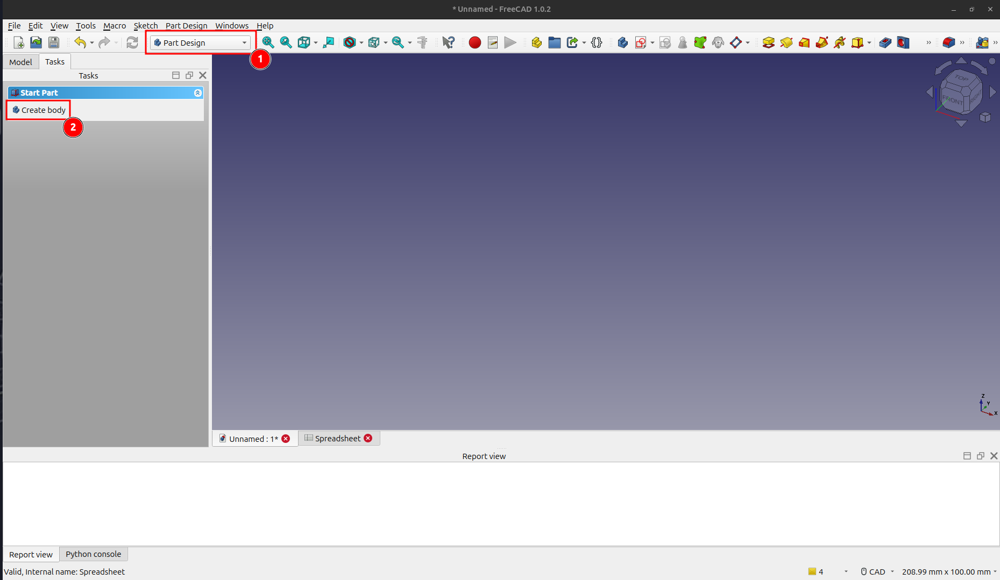
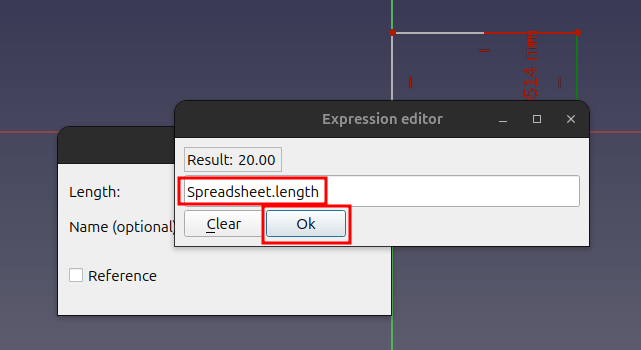
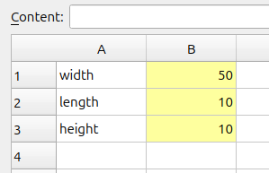

# Getting Started With FreeCAD: Spreadsheets and Parametric Design

## Introduction

Parametric design allows you to define the dimensions of your model using parameters. These parameters can be stored in a spreadsheet, making it incredibly easy to update your design. Change a value in the spreadsheet, and your 3D model will automatically update to reflect the new dimension. This saves you time and effort, especially in complex projects.

This guide will walk you through the process of creating a simple parametric cube in FreeCAD. You will learn how to:

*   Create a spreadsheet to store your design parameters.
*   Link the dimensions of your 3D model to the values in the spreadsheet.
*   Modify your model by simply changing the values in the spreadsheet.

By the end of this tutorial, you'll have a solid understanding of how to use spreadsheets to create parametric designs in FreeCAD.

## Getting Started

### Step 1: Create a Spreadsheet

1.  From the toolbar dropdown, select the **Spreadsheet** workbench.
2.  Click on the **Create Spreadsheet** icon to create a new spreadsheet.

### Step 2: Define Your Parameters

1.  Enter the following values into the spreadsheet:

| | A | B |
| :--- | :--- | :--- |
| **1** | Width | 10 |
| **2** | Length | 20 |
| **3** | Height | 30 |

### Step 3: Set Aliases for Your Parameters

To make our parameters easier to reference, we'll give them aliases.

1.  Right-click on cell **B1** (which contains the value `10`) and select **Properties** from the context menu.
2.  In the **Cell Properties** window, go to the **Alias** tab.
3.  Enter `width` as the alias and click **OK**.

4.  Repeat this process for cells **B2** and **B3**, using the aliases `length` and `height` respectively.

Once you've set the aliases, the cells should be highlighted in yellow, indicating that they have an alias.

### Step 4: Create the 3D Model

1.  From the toolbar dropdown, select the **Part Design** workbench.
2.  Click on the **Create Body** icon to create a new body for our model.

3.  Click on **Create sketch** to start sketching our model.
4.  Select the **XY-plane (Base plane)** and click **OK**.

### Step 5: Draw the Base of the Cube

1.  Click on the **Create Rectangle** icon and draw a rectangle of any size in the sketch editor.

### Step 6: Link the Sketch to the Spreadsheet

Now, we'll link the dimensions of the rectangle to the parameters in our spreadsheet.

1.  Select the vertical constraint of the rectangle. Click on the **f(x)** icon next to the length value to open the **Formula Editor**.

2.  In the **Formula Editor**, enter `Spreadsheet.length` and click **OK**.

3.  Next, select the horizontal constraint of the rectangle. Click on the **f(x)** icon next to the height value to open the **Formula Editor**.
4.  In the **Formula Editor**, enter `Spreadsheet.width` and click **OK**.

5.  Click **Close** to close the sketch editor.

### Step 7: Create the Pad

1.  With the sketch selected, click on the **Pad** icon to extrude the rectangle into a 3D shape.
2.  In the **Pad parameters**, click on the **f(x)** icon next to the **Length** value.
3.  In the **Formula Editor**, enter `Spreadsheet.height` and click **OK**. Then, click **OK** again to create the pad.

### Step 8: You're Done!

Congratulations! You have successfully created a parametric cube.

Now for the fun part! Go back to the **Spreadsheet** tab and change the values for `width`, `length`, and `height`. You'll see the cube automatically resize itself based on your changes.

## Conclusion

In this tutorial, you've learned the fundamentals of parametric design in FreeCAD. By using a spreadsheet to control the dimensions of your model, you can create flexible and easily modifiable designs. This is a powerful technique that can save you a lot of time and effort in your projects.

Now that you understand the basics, you can start exploring more complex parametric designs. Happy modeling!