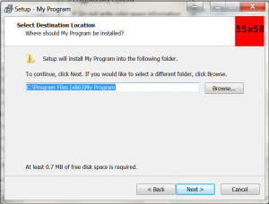
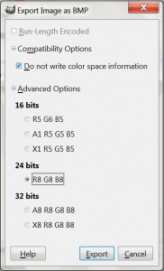

To customise the look of your inno installer, you can modify the images displayed on the install pages. The large image on the left hand side of the instal pages is set using the parameter WizardImageFile. The small image shown on the top right of the install pages is set using the parameter WizardSmallImageFile.

In this example I have replaced the standard images with a large red image. Hopefully you will make an image that is more appealing.

The WizardImageFile and WizardSmallImageFile parameters should be defined in the \[setup\] section of the inno install script. In this example the images are in the folder c:\\InstallFiles and are called Small.bmp and Large.bmp.

`[Setup] WizardSmallImageFile="C:\InstallFiles\Small.bmp" WizardImageFile="c:\InstallFiles\Large.bmp"`

The files must be saved as 256bit bmp files. I created my examples files using GIMP. To save the images using GIMP.

1. Click File > Export As...
2. Select a location for the file, enter a file name and then click export
3. Expand the 'Compatibility Options' and check 'Do not write color space information'. Expand the 'Advanced Options' and select 24 bits R8 G8 B8 and then click the export button

The small image should be 55x58 pixels. The large image should be 164x314 pixels.

Download full Inno script [CustomImage.iss](http://andrew-seaford.co.uk/code/CustomImages.iss "CustomImage.iss") Download images [Large.bmp](http://andrew-seaford.co.uk/code/Large.bmp "Large.bmp") [Small.bmp](http://andrew-seaford.co.uk/code/Small.bmp "Small.bmp")
