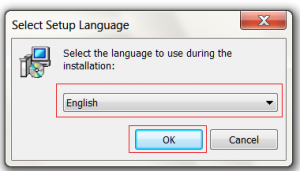
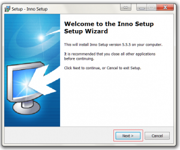
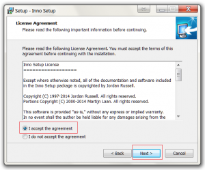
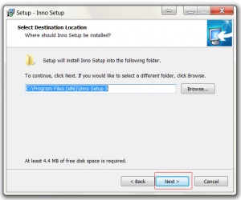
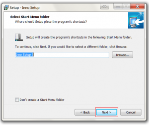
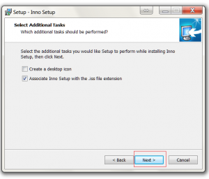
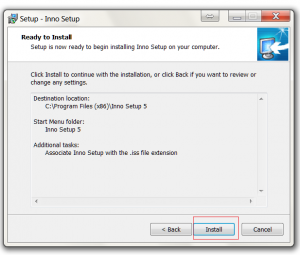

Detailed below is the procedure for installing Inno.

- Download the setup file. I will be installing version 5.5.5 http://www.jrsoftware.org/download.php/is.exe
- Select your language from the combo box and then click ok
- Click the Next button on the welcome screen.

- Select Accept and then click the next button

- Change the install location if required and then click the next button.

- Change the start menu icon location if required and then click the next button.

- Click Next button to to install the preprocessor. 

- Enable the additional settings if required and then click the next button.

- Click the install button to start the installation.
- Click the finish button to complete the install.

## Related Files

-   [https://github.com/seafooood/andrew-seaford.co.uk/tree/main/docs/inno/installing%20inno%20installer](https://github.com/seafooood/andrew-seaford.co.uk/tree/main/docs/inno/installing%20inno%20installer)
