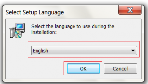
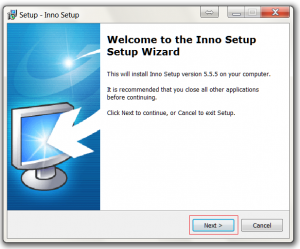
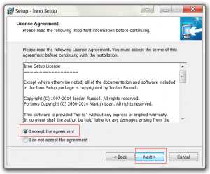
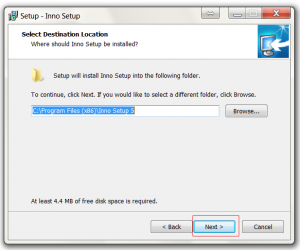
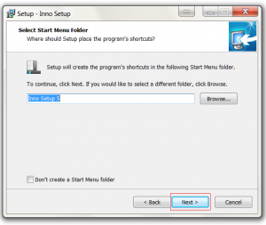
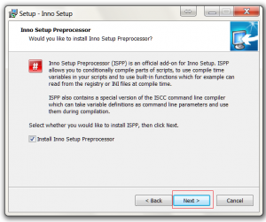
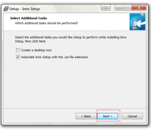
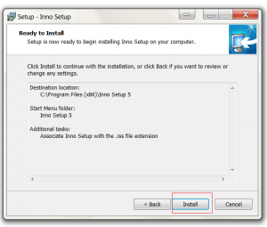
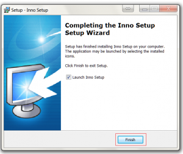

When preparing a Windows installer for your application, you might need to install Inno Setup. This guide will walk you through downloading and installing Inno Setup on a Windows system. By the end, you will have the Inno Setup IDE installed and ready to create installers.

### Step 1: Download the installer

Download the latest Inno Setup installer from the official site. The file is typically named `is.exe`.

[http://www.jrsoftware.org/download.php/is.exe](http://www.jrsoftware.org/download.php/is.exe)

### Step 2: Choose language and start the installer

Select your language from the language selector and click OK.

### Step 3: Welcome screen

Click the Next button on the welcome screen to continue.

### Step 4: Accept the license

Select Accept and then click Next to confirm the license terms.

### Step 5: Choose installation location

Change the installation location if required, then click Next.

### Step 6: Start menu folder

Change the start menu folder if required, then click Next.

### Step 7: Install the preprocessor

Click Next to install the Inno Setup preprocessor if you need it.

### Step 8: Additional options

Enable any additional settings you want and click Next to continue.

### Step 9: Install

Click Install to start the installation process.

### Step 10: Finish

Click Finish to complete the installation. The Inno Setup IDE will be available from your Start menu.

### Conclusion

You now have Inno Setup installed on Windows and can begin creating installers for your applications. If you plan to automate builds, consider scripting your Inno scripts or using the command line version of Inno Setup.

## Related Files

- [https://github.com/seafooood/andrew-seaford.co.uk/tree/main/docs/inno/installing-inno-installer](https://github.com/seafooood/andrew-seaford.co.uk/tree/main/docs/inno/installing-inno-installer)

## Inno Setup Related Articles

- [Automatically Get Target Exe Version in Inno](../automatically-target-exe-version-inno/index.md)
- [Check DotNet Framework is installed during Inno Setup](../check-dotnet-framework-installed-inno-setup/index.md)
- [Check if a program exists before installing with Inno](../check-program-exists-installing-inno/index.md)
- [Create empty folders using Inno](../create-empty-folders-inno/index.md)
- [Customize Inno Setup Installer Images: WizardImageFile Guide](../custom-inno-theme/index.md)
