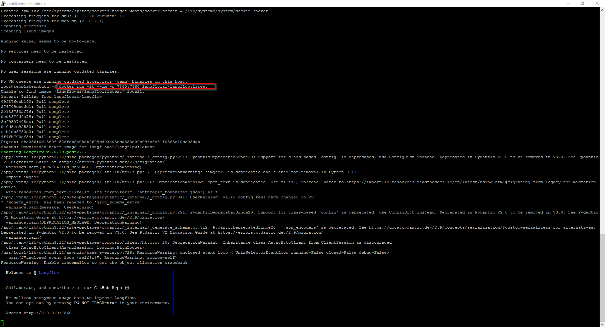

# How To Install Langflow on Ubuntu Using Docker

## Introduction

Install Langflow on Ubuntu using docker.


## Procedure

1. Installer docker

```bash
sudo apt-get install docker.io
```

2. Run latest container from langflow

```bash
docker run -it --rm -p 7860:7860 langflowai/langflow:latest
```



3. Navigate to http://127.0.0.1:7860

## References

https://hub.docker.com/r/langflowai/langflow

## Related Files

-   [https://github.com/seafooood/andrew-seaford.co.uk/tree/main/docs/langflow/how-to-install-langflow-on-ubuntu-using-docker](https://github.com/seafooood/andrew-seaford.co.uk/tree/main/docs/langflow/how-to-install-langflow-on-ubuntu-using-docker)

## Langflow Related Articles

- [How To Chat With Langflow From A Python Script](../how-to-chat-with-langflow-from-a-python-script/index.md)
- [How To Enable Logging In Langflow](../how-to-enable-logging-in-langflow/index.md)
- [How To Install Langflow on Ubuntu Without Docker](../how-to-install-langflow-on-ubuntu-without-docker/index.md)
- [A Guide to Removing Unused Docker Images on Ubuntu](../../docker/a-guide-to-removing-unused-docker-images-on-ubuntu/index.md)
- [Containerize An Inno Installed Application](../../docker/containerize-an-inno-installed-application/index.md)
