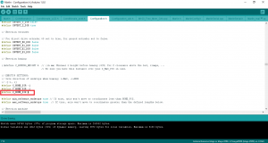

## Symptoms

CNC machine homes in the wrong direction.

## Relevant

Marlin 3D Printer Firmware running on Arduino Mega with RAMPS 1.4 shield.

## Procedure

The direction of travel when homing is configured in the configuration.h using the settings X\_HOME\_DIR, Y\_HOME\_DIR and Z\_HOME\_DIR in the section ENDSTOP SETTINGS. A value of -1 will set the homing direction towards the min end stop. A value of 1 will set the homing direction to the max end stop.

In the example below the homing direction for the z axis will be changed to home towards the max end stop.  

The Z home value was -1 and has been changed to 1.
  

## Related Files

-   [https://github.com/seafooood/andrew-seaford.co.uk/tree/main/docs/milling-machine-cnc/marlinfw-homing-direction](https://github.com/seafooood/andrew-seaford.co.uk/tree/main/docs/milling-machine-cnc/marlinfw-homing-direction)

## CNC Related Articles

- [Z Axis drops after completing job](../axis-drops-completing-job/index.md)
- [Reporting endstop status](../reporting-endstop-status/index.md)
- [Simple Box G Code](../simple-box-code/index.md)
- [3D Printed Puzzle Vase for Flowers — Ideal for Lego, Crochet, and Artificial Flower Displays](../../freecad/3d-printed-puzzle-vase-for-flowers/index.md)
- [3D Printed Toothbrush Holder](../../freecad/3d-printed-toothbrush-holder/index.md)
