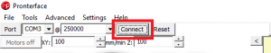
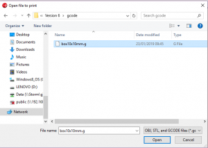

**Goal** The goal of this procedure is to draw a simple box 10x10mm.

**Relevant** Marlin 3D Printer Firmware running on Arduino Mega with RAMPS 1.4 shield. Controlled via Pronterface.

**Procedure** The procedure below is a simple gcode example that will show how to draw a simple 10mm box.

1. Create a text file with the following code. In this example, we will call the text file box10x10mm.g  

```gcode
G91 
G1 X10 
G1 Y10 
G1 X-10 
G1 Y-10
```

2. Open Pronterface

3. Click the Connect button, to connect to the device.  

[](images/buttonconnect.png)

4. Click the Home button, to home all of the axis.  

[](images/buttonhome.png)

5. Click the Load File button.

[](images/buttonloadfile.png)

6. Select the file created in step 1.

[](images/step2-select-file.png)

7. Click the Print button.

[](images/print.png)


## Related Files

-   [https://github.com/seafooood/andrew-seaford.co.uk/tree/main/docs/milling-machine-cnc/simple-box-code](https://github.com/seafooood/andrew-seaford.co.uk/tree/main/docs/milling-machine-cnc/simple-box-code)

## CNC Related Articles

- [Z Axis drops after completing job](../axis-drops-completing-job/index.md)
- [Marlinfw Homing Direction](../marlinfw-homing-direction/index.md)
- [Reporting endstop status](../reporting-endstop-status/index.md)
- [3D Printed Puzzle Vase for Flowers — Ideal for Lego, Crochet, and Artificial Flower Displays](../../freecad/3d-printed-puzzle-vase-for-flowers/index.md)
- [3D Printed Toothbrush Holder](../../freecad/3d-printed-toothbrush-holder/index.md)
