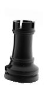

# Detecting Dominant Points in an Image using OpenCV in Python

This guide will walk you through the process of detecting dominant points in an image using OpenCV in Python. Dominant points are the most important points in a contour, and they can be used to approximate the shape of the contour.

## The Python Script

The Python script `dominantpoints.py` loads an image, thresholds it, finds contours, and then approximates the dominant points of each contour. It then draws the contours and dominant points on a new image and displays it.

```python
import cv2
import numpy as np
import argparse

def load_image(image_path):
    """Loads an image in grayscale."""
    return cv2.imread(image_path, cv2.IMREAD_GRAYSCALE)

def threshold_image(image, thresh_val=230):
    """Applies binary thresholding to an image."""
    _, edge = cv2.threshold(image, thresh_val, 255, cv2.THRESH_BINARY)
    return _, edge

def find_contours(image):
    """Finds contours in a binary image."""
    contours, _ = cv2.findContours(image, cv2.RETR_LIST, cv2.CHAIN_APPROX_SIMPLE)
    return contours

def approximate_dominant_points(contour, epsilon_factor=0.04):
    """Approximates the dominant points of a contour."""
    epsilon = epsilon_factor * cv2.arcLength(contour, True)
    return cv2.approxPolyDP(contour, epsilon, True)

def draw_contours(image, contours):
    """Draws contours on an image."""
    cv2.drawContours(image, contours, -1, (255, 255, 255), 1)

def draw_dominant_points(image, dominant_points):
    """Draws dominant points on an image."""
    for point in dominant_points:
        cv2.circle(image, tuple(point[0]), 3, (255, 0, 0), -1)

def display_image(window_name, image):
    """Displays an image in a window."""
    cv2.imshow(window_name, image)

def wait_for_key():
    """Waits for a key press."""
    cv2.waitKey(0)

def destroy_windows():
    """Destroys all OpenCV windows."""
    cv2.destroyAllWindows()


def main():
    """Main function to run the dominant points detection."""
    parser = argparse.ArgumentParser(description='Detect dominant points in an image.')
    parser.add_argument('--epsilon', type=float, default=0.04,
                        help='Epsilon factor for dominant point approximation.')
    args = parser.parse_args()

    input_image = load_image("test.jpg")
    if input_image is None:
        print("Error: Could not load image 'test.jpg'")
        return

    display_image("Input", input_image)

    _, edge = threshold_image(input_image)
    display_image("Threshold", edge)

    contours = find_contours(edge)
    print(f"Total contours found = {len(contours)}")

    output = np.zeros_like(input_image)
    draw_contours(output, contours)

    for contour in contours:
        dominant_points = approximate_dominant_points(contour, args.epsilon)
        print(f"Dominant points total={len(dominant_points)}")
        draw_dominant_points(output, dominant_points)
        for point in dominant_points:
            print(f"  {point[0][0]} {point[0][1]}")

    display_image("Output", output)
    wait_for_key()
    destroy_windows()

if __name__ == '__main__':
    main()
```

## How to Run the Script

1. **Save the script:** Save the code above as `dominantpoints.py`.
2. **Install OpenCV:** If you don't have OpenCV installed, you can install it using pip:

    ```bash
    pip install opencv-python
    ```

3. **Get an image:** Find an image you want to test the script with and save it as `test.jpg` in the same directory as the script.

4. **Run the script:** Open a terminal or command prompt,  and run the script.

    You can optionally provide an `--epsilon` value to control the number of points detected. A smaller epsilon will detect more points.

    ```bash
    python dominantpoints.py --epsilon 0.01
    ```

The script will display three windows: the input image, the thresholded image, and the output image with the contours and dominant points drawn on it. Press any key to close the windows.

## Output

```log
python3 ./dominantpoints.py --epsilon 0.01
Total contours found = 2
Dominant points total=14
  23 33
  34 33
  34 42
  38 33
  59 36
  57 106
  66 115
  66 131
  52 141
  25 139
  6 130
  7 112
  15 106
  21 83
Dominant points total=4
  0 0
  0 146
  80 146
  80 0
```

|Input|Threshold|Output|
|---|---|---|
||||

## Related Files

- [https://github.com/seafooood/andrew-seaford.co.uk/tree/main/docs/opencv/detecting-dominant-points-image-opencv-in-python](https://github.com/seafooood/andrew-seaford.co.uk/tree/main/docs/opencv/detecting-dominant-points-image-opencv-in-python)

## Related Articles

- [detecting dominant points image opencv in C](<../detecting-dominant-points-image-opencv/index.md>)
