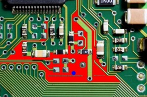

To use the flood fill, first a seed point is selected, then all neighbouring pixels of a similar colour are converted to a uniform colour. In this example the seed point is at 200, 200 (shown by a blue circle). The neighbouring pixels are then flood filled with a red colour.

```
#include "stdafx.h"
#include "cv.h"
#include "highgui.h"

int _tmain(int argc, _TCHAR* argv[])
{
	// load the input image
	IplImage* img = cvLoadImage("test.jpg");

	// define the seed point
	CvPoint seedPoint = cvPoint(200,200);

	// flood fill with red
	cvFloodFill(img, seedPoint, CV_RGB(255,0,0), CV_RGB(8,90,60), CV_RGB(10,100,70),NULL,4,NULL);
	
	// draw a blue circle at the seed point
	cvCircle(img, seedPoint, 3, CV_RGB(0,0,255), 3, 8);

	// show the output
	cvNamedWindow("Output", CV_WINDOW_AUTOSIZE);  
    cvShowImage("Output", img); 

	// wait for user
	cvWaitKey(0);

	// save image
	cvSaveImage("output.jpg",img);

	// garbage collection		
	cvReleaseImage(&img);
	cvDestroyWindow("Output");
	return 0;
}

```

\[caption id="attachment\_130" align="alignnone" width="300"\][](images/input2.png) Input image\[/caption\]\[caption id="attachment\_131" align="alignnone" width="300"\][](images/output.jpg) The flood filled output image\[/caption\]
