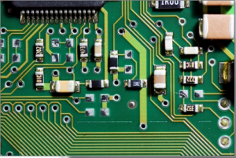
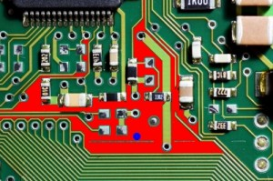

To use the flood fill, first a seed point is selected. All neighbouring pixels whose colours are similar to the seed region are replaced with a uniform colour. Flood fill is useful for simple segmentation tasks, region filling, and cleaning up shapes before analysis. In this example the seed point is at 200, 200 (shown by a blue circle). The neighbouring pixels are then flood filled with a red colour.

```
#include "stdafx.h"
#include "cv.h"
#include "highgui.h"

int _tmain(int argc, _TCHAR* argv[])
{
	// load the input image
	IplImage* img = cvLoadImage("test.jpg");

	// define the seed point
	CvPoint seedPoint = cvPoint(200,200);

	// flood fill with red
	cvFloodFill(img, seedPoint, CV_RGB(255,0,0), CV_RGB(8,90,60), CV_RGB(10,100,70),NULL,4,NULL);
	
	// draw a blue circle at the seed point
	cvCircle(img, seedPoint, 3, CV_RGB(0,0,255), 3, 8);

	// show the output
	cvNamedWindow("Output", CV_WINDOW_AUTOSIZE);  
    cvShowImage("Output", img); 

	// wait for user
	cvWaitKey(0);

	// save image
	cvSaveImage("output.jpg",img);

	// garbage collection		
	cvReleaseImage(&img);
	cvDestroyWindow("Output");
	return 0;
}

```

	\[caption id="attachment\_130" align="alignnone" width="300"\][](images/input2.png) Input image\[/caption\]\[caption id="attachment\_131" align="alignnone" width="300"\][](images/output.jpg) The flood filled output image\[/caption\]

	## Explanation of cvFloodFill parameters

	The example uses the old C API call `cvFloodFill`. Below is a simple explanation of the parameters used in the call shown above:

	- `image`: The image to be modified in place. The function fills pixels in this image.
	- `seedPoint`: A `CvPoint` that marks the starting pixel for the flood fill. Filling spreads from this seed.
	- `newVal`: A `CvScalar` colour value used to set the filled region (for example `CV_RGB(255,0,0)` for red).
	- `loDiff`: A `CvScalar` specifying the lower brightness/color difference tolerance. Pixels with values not less than `seed - loDiff` are considered for filling.
	- `upDiff`: A `CvScalar` specifying the upper brightness/color difference tolerance. Pixels with values not greater than `seed + upDiff` are considered for filling.
	- `comp`: Optional pointer to a `CvConnectedComp` structure that receives information about the filled region. In the example `NULL` is passed because the component info is not needed.
	- `flags`: Controls the connectivity and filling behavior. Common values include `4` or `8` for pixel connectivity. Flags can also request a mask or return the bounding rectangle.
	- `rect`: Optional pointer to a `CvRect` that, if provided, will receive the bounding rectangle of the filled region. The example passes `NULL`.

	Notes:
	- The `loDiff` and `upDiff` parameters define how permissive the flood fill is. Larger values allow filling more varied neighbouring pixels. Tune these values to avoid overfilling.
	- The C API has been superseded by newer C++ functions such as `cv::floodFill`, which has a similar parameter set but uses C++ types.

	## Expected output

	Running the example produces an output image where the connected region around the seed point is replaced with the specified fill colour. The program also draws a small blue circle at the seed point to indicate the start location. The output is displayed in a window and saved as `output.jpg`.

	- **Filled region**: The area connected to the seed and within the `loDiff`/`upDiff` tolerances will be painted red.
	- **Seed marker**: A blue circle marks the seed point at (200, 200).
	- **Saved file**: The final image is written to `output.jpg` in the working directory.

	If the tolerances are too large, the fill may spread beyond the intended region. If they are too small, only the immediate area will be filled.


## Related Files

-   [https://github.com/seafooood/andrew-seaford.co.uk/tree/main/docs/opencv/flood-fill-opencv](https://github.com/seafooood/andrew-seaford.co.uk/tree/main/docs/opencv/flood-fill-opencv)

## OpenCV Related Articles

- [Detecting the Dominant points on an image using OpenCV](../detecting-dominant-points-image-opencv/index.md)
- [Detecting Dominant Points in an Image using OpenCV in Python](../detecting-dominant-points-in-an-image-using-opencv-in-python/index.md)
- [Drawing simple shapes using OpenCV](../drawing-simple-shapes-opencv/index.md)
- [Gaussian image smoothing using OpenCV](../gaussian-image-smoothing-opencv/index.md)
- [Image Contour detection and display using OpenCV](../image-contour-detection-display-opencv/index.md)
