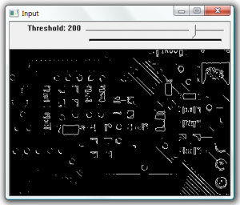

In this example we threshold the image based on the position of the track bar. Then find contours on the image an display the contours as white lines.

```
#include "stdafx.h"
#include "cv.h"
#include "highgui.h"

// global variables
IplImage* input = NULL;
IplImage* gray = NULL;
int threshold = 100;
CvMemStorage* storage = NULL;

/** trackbar event
 * @param trackbar position
 */
void on_trackbar(int)
{
	
	if (storage == NULL)
	{
		// create storage
		gray = cvCreateImage(cvGetSize(input), 8,1);
		storage = cvCreateMemStorage(0);
	}
	else
	{
		// clear storage
		cvClearMemStorage(storage);
	}

	// convert to gray scale and then threshold
	cvCvtColor(input, gray, CV_BGR2GRAY);
	cvThreshold(gray,gray,threshold,255,CV_THRESH_BINARY);

	// find the edges
	CvSeq* edges = 0;
	cvFindContours(gray, storage, &edges);
	cvZero(gray);
	if (edges)
	{
		// display the edges as whiet lines
		cvDrawContours(gray, edges, cvScalarAll(255),cvScalarAll(255),100);
	}
	cvShowImage("Input", gray);
}

/** main function
 * @param argc arguments
 * @param argv argument values
 * @return exit code
 */
int _tmain(int argc, _TCHAR* argv[])
{
	// open and display input image  
    input = cvLoadImage("test.jpg");  
    cvNamedWindow("Input", CV_WINDOW_AUTOSIZE);  
    cvShowImage("Input", input); 

	// create trackbar callback
	cvCreateTrackbar("Threshold", "Input", &threshold, 255, on_trackbar);
	on_trackbar(0);

	// wait for user
	cvWaitKey(0);

	// garbage collection	
	cvReleaseImage(&input);
	cvDestroyWindow("Input");
	return 0;
}

```

\[caption id="attachment\_146" align="alignnone" width="300"\][](images/input4.png) The input image\[/caption\]\[caption id="attachment\_147" align="alignnone" width="300"\][](images/edge100.png) Threshold value 100\[/caption\]\[caption id="attachment\_148" align="alignnone" width="300"\][](images/edge150.png) Threshold value 150\[/caption\]\[caption id="attachment\_149" align="alignnone" width="300"\][](images/edge200.png) Threshold value 200\[/caption\]


## Related Files

-   [https://github.com/seafooood/andrew-seaford.co.uk/tree/main/docs/opencv/image-contour-detection-display-opencv](https://github.com/seafooood/andrew-seaford.co.uk/tree/main/docs/opencv/image-contour-detection-display-opencv)
