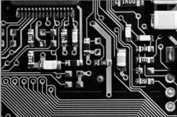

To separate a multi channel image into the three component RGB channels, we can use the cvSplit function. The example below opens a RGB image and then using the cvSplit function creates three output images.

```
#include "stdafx.h"
#include "cv.h"
#include "highgui.h"

int _tmain(int argc, _TCHAR* argv[])
{
	// open and display input image  
    IplImage* input = cvLoadImage("test.jpg");  
    cvNamedWindow("Input", CV_WINDOW_AUTOSIZE);  
    cvShowImage("Input", input); 

	// create the output images
	IplImage* output_r = cvCreateImage(cvSize(input->width, input->height), input->depth, 1);
	IplImage* output_g = cvCreateImage(cvSize(input->width, input->height), input->depth, 1);
	IplImage* output_b = cvCreateImage(cvSize(input->width, input->height), input->depth, 1);

	// split the image
	cvSplit(input, output_r, output_g, output_b,NULL);
	
	// display image
	cvNamedWindow("Output R", CV_WINDOW_AUTOSIZE);
	cvShowImage("Output R", output_r);

	cvNamedWindow("Output G", CV_WINDOW_AUTOSIZE);
	cvShowImage("Output G", output_g);

	cvNamedWindow("Output B", CV_WINDOW_AUTOSIZE);
	cvShowImage("Output B", output_b);

	// wait for user
	cvWaitKey(0);

	// garbage collection	
	cvReleaseImage(&input);
	cvDestroyWindow("Input");
	cvReleaseImage(&output_r);
	cvDestroyWindow("Output R");
	cvReleaseImage(&output_g);
	cvDestroyWindow("Output G");
	cvReleaseImage(&output_b);
	cvDestroyWindow("Output B");
	return 0;
}

```

\[caption id="attachment\_121" align="alignnone" width="300" caption="Input Image"\][](http://www.andrew-seaford.co.uk/wp-content/uploads/2012/07/input1.png)\[/caption\]\[caption id="attachment\_122" align="alignnone" width="300" caption="Blue Channel"\][](http://www.andrew-seaford.co.uk/wp-content/uploads/2012/07/output_b.png)\[/caption\]\[caption id="attachment\_123" align="alignnone" width="300" caption="Green Channel"\][](http://www.andrew-seaford.co.uk/wp-content/uploads/2012/07/output_g.png)\[/caption\]\[caption id="attachment\_124" align="alignnone" width="300" caption="Red Channel"\][](http://www.andrew-seaford.co.uk/wp-content/uploads/2012/07/output_r.png)\[/caption\]
