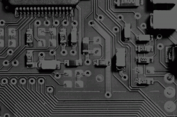

The cvThreshold function allows us to reject pixels above or below a set value while keeping the others. In this example the input image is separated into the RGB channels. Then we preform a threshold on the red channel, with a maximum value of 100. The result of this is that all the light areas of the image are removed.

```
#include "stdafx.h"
#include "cv.h"
#include "highgui.h"

int _tmain(int argc, _TCHAR* argv[])
{
	// open and display input image  
    IplImage* input = cvLoadImage("test.jpg");  
    cvNamedWindow("Input", CV_WINDOW_AUTOSIZE);  
    cvShowImage("Input", input); 

	// create the output images
	IplImage* channel_r = cvCreateImage(cvSize(input->width, input->height), input->depth, 1);
	IplImage* channel_g = cvCreateImage(cvSize(input->width, input->height), input->depth, 1);
	IplImage* channel_b = cvCreateImage(cvSize(input->width, input->height), input->depth, 1);

	// split the image
	cvSplit(input, channel_r, channel_g, channel_b, NULL);
	
	// display image
	cvNamedWindow("Channel R", CV_WINDOW_AUTOSIZE);
	cvShowImage("Channel R", channel_r);
	cvSaveImage("channel_r.png", channel_r);

	// threshold red channel
	IplImage* output = cvCreateImage(cvSize(channel_r->width, channel_r->height), channel_r->depth, 1);
	cvThreshold(channel_r, output, 100,100, CV_THRESH_TRUNC);

	// display the output image
	cvNamedWindow("Output", CV_WINDOW_AUTOSIZE);
	cvShowImage("Output", output);
	cvSaveImage("output.png", output);

	// wait for user
	cvWaitKey(0);

	// garbage collection	
	cvReleaseImage(&input);
	cvDestroyWindow("Input");
	cvReleaseImage(&channel_r);
	cvDestroyWindow("Channel R");
	cvReleaseImage(&output);
	cvDestroyWindow("Output");
	return 0;
}

```

\[caption id="attachment\_138" align="alignnone" width="300"\][](images/input3.png) Input Image\[/caption\] \[caption id="attachment\_139" align="alignnone" width="300"\][](images/channel_r.png) The red channel, before threshold\[/caption\]\[caption id="attachment\_140" align="alignnone" width="300"\][](images/output2.png) The red channel, after threshold\[/caption\]


## Related Files

-   [https://github.com/seafooood/andrew-seaford.co.uk/tree/main/docs/opencv/threshold%20image%20opencv](https://github.com/seafooood/andrew-seaford.co.uk/tree/main/docs/opencv/threshold%20image%20opencv)
