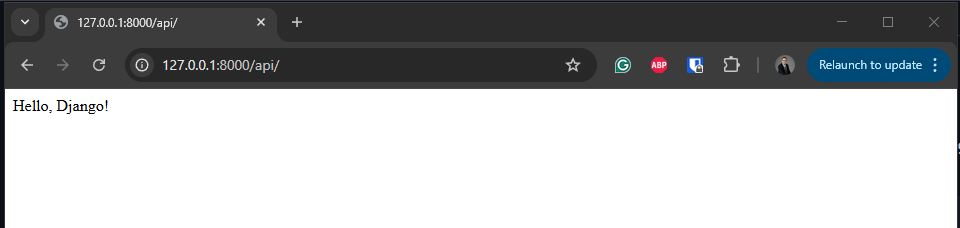
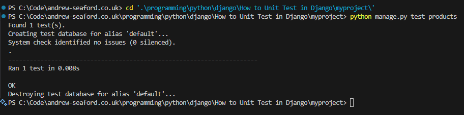
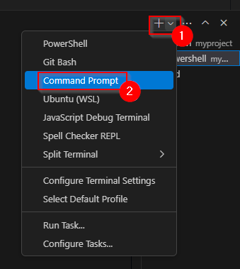
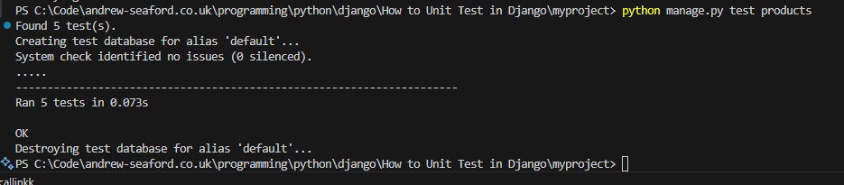

# How to Unit Test in Django

Django's test framework extends unittest.TestCase with django.test.TestCase, providing additional features like:

* Database Rollback: Each test runs in isolation with a separate test database.
* Client Simulation: You can simulate requests to views using self.client.
* Fixture Loading: You can load test data using fixtures.

## Step 1 - Set up the Django project

* Install the necessary packages

```bash
pip install django djangorestframework
```

* Create a Django Project & App

```bash
django-admin startproject myproject
cd myproject
django-admin startapp products
```

* Add products and rest_framework to INSTALLED_APPS in [myproject/settings.py](myproject/myproject/settings.py).

```python
INSTALLED_APPS = [
    'django.contrib.admin',
    'django.contrib.auth',
    'django.contrib.contenttypes',
    'django.contrib.sessions',
    'django.contrib.messages',
    'django.contrib.staticfiles',
    'rest_framework',  # DRF
    'products',  # Products app
]
```

* Include the product url in the in [myproject/urls.py](myproject/myproject/urls.py)

```python
from django.contrib import admin
from django.urls import path, include

urlpatterns = [
    path('admin/', admin.site.urls),
    path('api/', include('products.urls')),
]
```

## Step 2 - Create basic home page

* Edit [products/views.py](myproject/products/views.py)and add a home function.

```python
def home(request):
    return HttpResponse("Hello, Django!")
```

* Add the home function to the urlpatterns in [products/urls.py](myproject/products/urls.py)

```python
path('', home, name='home'),
```

* Start the application

```bash
python manage.py runserver
```

* With a web browser navigate to [http://127.0.0.1:8000/api/](http://127.0.0.1:8000/api/) and confirm the page displays the text from the home function `Hello, Django!`.



## Step 3 - Unit test basic home page

To unit test the basic home page.

* Create a new directory for the unit tests within the product app. `products/product_tests`

* Inside the new directory create an empty file called [products/product_tests/__init__.py](myproject/products/product_tests/__init__.py)

* Create the file [products/product_tests/test_home.py](myproject/products/product_tests/test_home.py)

```python
from django.test import TestCase
from django.urls import reverse
from rest_framework import status
from rest_framework.test import APITestCase
from products.models import Product

class ProductAPITestCase(APITestCase):

    def test_get_products(self):
        """Test confirms that the API home page display the text 'Hello, Django!'."""

        # Arrange 
        home_url = reverse('home')
        expected_response = "Hello, Django!"

        # Act
        actual_response = self.client.get(home_url)

        # Assert
        self.assertEqual(actual_response.status_code, status.HTTP_200_OK) # Check the status code to confirm the request was executed successfully 
        self.assertEqual(actual_response.content.decode(), expected_response) # Check the response content to confirm the expected text is displayed
```

* Execute the test unit

```bash
python manage.py test products
```

## Step 4 - Create the API

* Define the Product Model in [products/models.py](myproject/products/models.py). The model will store the data for the products, such as name and price.

```python
from django.db import models

class Product(models.Model):
    name = models.CharField(max_length=100)
    price = models.DecimalField(max_digits=10, decimal_places=2)

    def __str__(self):
        return self.name
```

* Apply migrations:

```bash
python manage.py makemigrations
python manage.py migrate
```

* Create a Serializer. Create file [products/serializers.py](myproject/products/serializers.py)

```python
from rest_framework import serializers
from .models import Product

class ProductSerializer(serializers.ModelSerializer):
    class Meta:
        model = Product
        fields = '__all__'
```

* Create a ViewSet. Edit [products/views.py](myproject/products/views.py)

```python
from rest_framework import viewsets
from .models import Product
from .serializers import ProductSerializer
from django.http import HttpResponse

class ProductViewSet(viewsets.ModelViewSet):
    queryset = Product.objects.all()
    serializer_class = ProductSerializer

def home(request):
    return HttpResponse("Hello, Django!")
```

* Set Up URLs. Create file [products/urls.py](myproject/products/urls.py)

```python
from django.urls import path, include
from rest_framework.routers import DefaultRouter
from .views import ProductViewSet
from .views import home

router = DefaultRouter()
router.register(r'products', ProductViewSet)

urlpatterns = [
    path('', home, name='home'),
    path('', include(router.urls)),
]
```

## Step 5 - Unit test the model

* Create a file for the model tests [products/product_tests/test_models.py](myproject/products/product_tests/test_models.py)

```python
from django.test import TestCase
from products.models import Product

class ProductModelTest(TestCase):

    def test_create_product(self):
        """Test confirms that a Product instance is created correctly."""
        
        # Arrange
        name = "Laptop"
        price = 1000.00

        # Act
        product = Product.objects.create(name=name, price=price)

        # Assert
        self.assertEqual(product.name, "Laptop")
        self.assertEqual(product.price, 1000.00)
```

* Run the unit test.

```bash
python manage.py test products
```



## Step 6 - Unit test the view

* The following section will explain how to unit test and manually test the product view, using web browser and curl.

* Run the site by executing `python manage.py runserver`, so that you can manually test the API using cURL, Postman, or your browser.


### Test Retrieving All Products (GET /api/products/)

* To view a list of the products use a web browser to navigate to [http://127.0.0.1:8000/api/products/](http://127.0.0.1:8000/api/products/), the list will be empty.


* To view the product list using curl execute a curl command from the CMD command prompt (PowerShell aliases curl to Invoke-WebRequest, which does not support the -X parameter). In VS Code, create the terminal by clicking the dropdown next to the plus icon, then select `Command Prompt`.



```cmd
curl -X GET http://127.0.0.1:8000/api/products/ 
```


* To unit test getting all products, create the file [products/product_tests/test_view.py](myproject/products/product_tests/test_view.py)

```python
from django.test import TestCase
from django.urls import reverse
from rest_framework import status
from rest_framework.test import APITestCase
from products.models import Product

class ProductAPITestCase(APITestCase):

        def test_get_products(self):
        """Test confirms that the API returns a list of all products."""

        # Arrange - No additional setup needed

        # Act
        response = self.client.get(self.list_url)

        # Assert
        self.assertEqual(response.status_code, status.HTTP_200_OK) # Check the status code to confirm the request was executed successfully 
```

* Execute the tests

```bash
python manage.py test products
```


### Test Creating a Product (POST /api/products/)

In the example we going to add a new product called `Phone` with the price `500.00`. Execute a POST using curl, the response should return 201 Created. Then execute a second curl to get the list of products.

```cmd
curl -X POST http://127.0.0.1:8000/api/products/ -H "Content-Type: application/json" -d "{\"name\": \"Phone\", \"price\": 500.00}"
curl -X GET http://127.0.0.1:8000/api/products/ 
```


You can also browse [http://127.0.0.1:8000/api/products/](http://127.0.0.1:8000/api/products/) to confirm the product was created.


To unit test, adding products, add the function `test_create_product` to [products/product_tests/test_view.py](myproject/products/product_tests/test_view.py)

```python
    def test_create_product(self):
        """Test confirms that a new product can be created via API."""

        # Arrange
        data = {"name": "Phone", "price": 500.00}

        # Act
        response = self.client.post(self.list_url, data)

        # Assert
        self.assertEqual(response.status_code, status.HTTP_201_CREATED) # Check the status code to confirm a record was created
        self.assertEqual(Product.objects.count(), 2) # Confirm the products list contains to items
```

* Run the tests

```bash
python manage.py test products
```


### Test Retrieving a Single Product (GET /api/products/1/)

* To get a single products details, in this example we are going to get the details for the product, with product id 1. Execute curl to get the product details.

```bash
curl -X GET http://127.0.0.1:8000/api/products/1/
```


* or navigate to [http://127.0.0.1:8000/api/products/1/](http://127.0.0.1:8000/api/products/1/)


To unit test, adding products, add the function `test_get_product_detail`

```python
def test_get_product_detail(self):
    """Test confirms that an individual product's details can be retrieved."""

    # Arrange - Product is already created in setUp()

    # Act
    response = self.client.get(self.detail_url)

    # Assert
    self.assertEqual(response.status_code, status.HTTP_200_OK) # Check the status code to confirm the request was executed successfully 
    self.assertEqual(response.data['name'], "Laptop") # Check the products name
```

* Run the tests

```bash
python manage.py test products
```


### Test Updating a Product (PUT /api/products/1/)

In this example, we are going to update the details for the product with the id 1. We going to change the name to `Smartphone` and the price to `600.00`. Execute the PUT request using curl. The execute a second GET request for product 1 to confirm the product details have been updated.

```bash
curl -X PUT http://127.0.0.1:8000/api/products/1/ -H "Content-Type: application/json" -d "{\"name\": \"Smartphone\", \"price\": 600.00}"
curl -X GET http://127.0.0.1:8000/api/products/1/
```


* To unit test updating a product add the function 

```python
def test_update_product(self):
    """Test confirms that an existing product can be updated."""

    # Arrange
    data = {"name": "Smartphone", "price": 600.00}

    # Act
    response = self.client.put(self.detail_url, data)

    # Assert
    self.assertEqual(response.status_code, status.HTTP_200_OK)
    self.product.refresh_from_db()
    self.assertEqual(self.product.name, "Smartphone") # Confirm name change
    self.assertEqual(self.product.price, 600.00) # Confirm price change
```

* Run the tests

```bash
python manage.py test products
```



### Test Deleting a Product (DELETE /api/products/1/)

* To delete product id 1, execute DELETE request using curl, then execute a second curl request to confirm the product has been deleted.

```bash
curl -X DELETE http://127.0.0.1:8000/api/products/1/
curl -X GET http://127.0.0.1:8000/api/products/1/
```


To unit test deleting a product create the function `def test_delete_product(self):`

```python
def test_delete_product(self):
    """Test confirms that a product can be deleted via API."""

    # Arrange - Product exists (created by setup)

    # Act
    response = self.client.delete(self.detail_url)

    # Assert
    self.assertEqual(response.status_code, status.HTTP_204_NO_CONTENT)
    self.assertEqual(Product.objects.count(), 0)
```

* Run the tests

```bash
python manage.py test products
```


## Related Files

-   [https://github.com/seafooood/andrew-seaford.co.uk/tree/main/docs/programming%20python/django/How%20to%20Unit%20Test%20in%20Django](https://github.com/seafooood/andrew-seaford.co.uk/tree/main/docs/programming%20python/django/How%20to%20Unit%20Test%20in%20Django)
