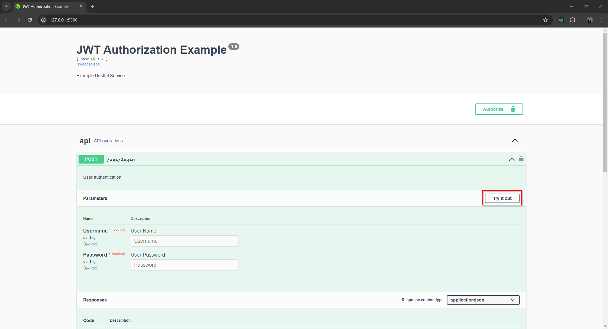
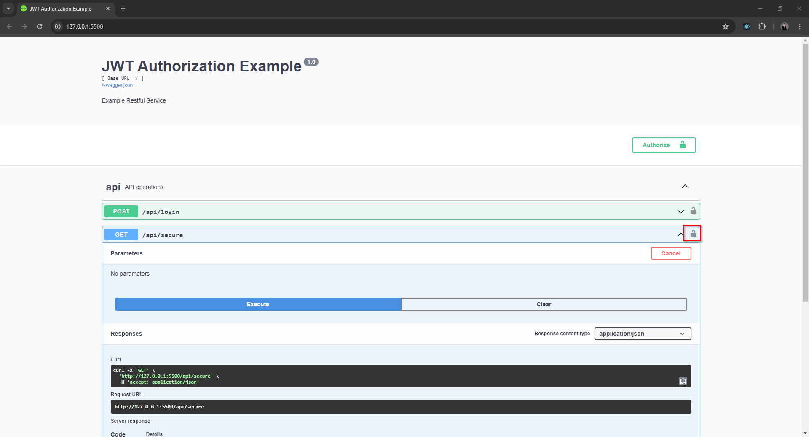

# How To Secure A Flask Python Application

## Introduction

Securing a Python Flask application with JWT authentication is crucial for safeguarding sensitive data and ensuring user privacy and security. JWT (JSON Web Tokens) authentication offers a lightweight, stateless mechanism for verifying the identity of clients accessing the application. By implementing JWT authentication, developers can prevent unauthorized access to resources and endpoints within the Flask application.

JWT authentication adds an extra layer of security by generating tokens that contain encoded user information, which can be securely transmitted between the client and the server. These tokens are signed with a secret key, making them tamper-proof and resistant to unauthorized alterations. With JWT, developers can enforce access controls, validate the integrity of incoming requests, and manage user sessions efficiently without relying on server-side storage.

Furthermore, JWT authentication enhances scalability and performance by eliminating the need for server-side session management, reducing the burden on server resources. This approach also promotes interoperability, allowing different services and platforms to authenticate users seamlessly using standardized JWT tokens. Overall, securing a Python Flask application with JWT authentication helps mitigate security risks, enhances user experience, and ensures compliance with modern security standards.

In this article, we are going to secure a simple Python Flask application backend and build a simple HTML frontend that will make requests to the backend.

## The Backend

The backend Python Flask application hosts three endpoints.

* GET /api/unsecure

    The Unsecured endpoint returns data without authorization.

* GET /api/secure

    The secure endpoint requires authorization

* POST /api/login

    The login endpoint validates a user's credentials and returns an access token.

### Creating The Backend Application

- Create a text file called `backend.py` and enter the code from [backend.py](backend.py).
- From the terminal, install the required libraries

```bash
pip install flask
pip install flask_restx
pip install flask_cors
pip install flask_jwt_extended
```

### Testing The Backend Application

- From the terminal execute the Python application `python backend.py`

- The console output from the Python application will display the server address. In this example, the backend is hosted at http://127.0.0.1:5500


- Open a web browser and navigate to http://127.0.0.1:5500

- The web browser will show the Swagger page for the backend. Click *api* to display the endpoints.


- Test the unsecure endpoint
    - Click the *GET* next to /api/unsecure
    
    - Click *Try it out* button
    
    - Click *Execute* button
    
    - The *Response Body* will display the JSON response from the GET request.
    

- Test the secure endpoint without authorization
    - Click the *GET* next to /api/secure
    
    - Click *Try it out* button and then click the *Execute* button. The *Response Body* will display the message "Missing Authorization Header".
    

- Generate Authorization Token 
    - Click *POST* next to /api/login
    
    - Click the *Try it out* button
    
    - Enter the username *kyle*, password *p1* and click the *Execute* button.
    
    - Copy the access token from the *Response Body*.
    

- Test the secure endpoint with authentication
    - Click the padlock icon on the right hand side of *GET* /api/secure
    
    - Enter *Bearer* into the value text box followed by the access token, then click the *Authorize* button.
    
    - Click the *Close* button to close the authorization window.
    
    - Click the *Execute* button, this time the *Response Body* should show the JSON data from the request.
    

### Endpoint Authentication

The main difference between the definitions for the secure and unsecure endpoints are the function decorators.

Unsecure endpoint

```python
@ns.route('/unsecure')
class UnsecureData(Resource):
    def get(self):
```

Secure endpoint, note the function decorators `@jwt_required()` and `@ns.doc(security='jsonWebToken')`. The decorators enforce that the request header must contain the access token.

```python
@ns.route('/secure')
class SecureData(Resource):
    @jwt_required()
    @ns.doc(security='jsonWebToken')
    def get(self):
```

## The Frontend

### Creating The Frontend Application

- Create a text file called `frontend.html` and enter the code from frontend.html.

### Testing The Frontend Application

- Using a web browser open the file `frontend.html`


- Enter the username *kyle*, password *p1* and then click the *Log In* button.


- Click the *OK* button to confirm the successful login.


- Click the *Get Secure Data* button, the JSON response data will be displayed below the button.


## Summary

In this solution, no user credentials are stored in the front end. The backend validates the user's name and password and returns a temporary access token, the access token is used to authorize requests to the backend endpoints.


## Related Files

-   [https://github.com/seafooood/andrew-seaford.co.uk/tree/main/docs/programming-python/flask/flaskauthentication](https://github.com/seafooood/andrew-seaford.co.uk/tree/main/docs/programming-python/flask/flaskauthentication)
