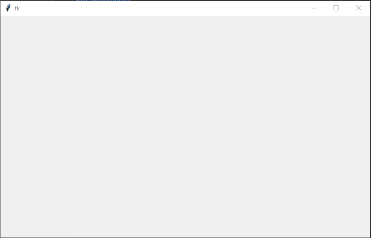
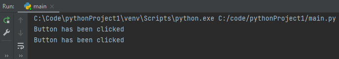
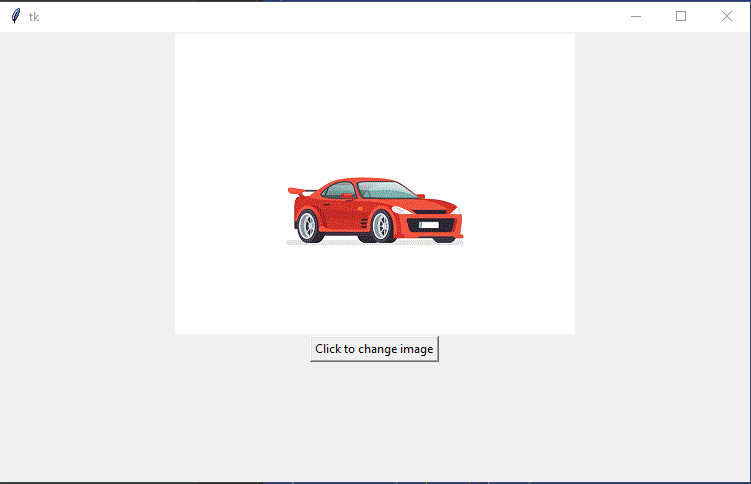

The aim of the tutorial is to display an image using Tkinter. The image will change when a button is pressed.

## **Step 1**

Create the Tkinter window.

```
import tkinter as tk

win = tk.Tk()
win.geometry("750x450")

win.mainloop()
```

When executed the code should generate a window 750 by 450.

<figure>

[](https://www.andrew-seaford.co.uk/wp-content/uploads/2022/10/image.png)

<figcaption>

TK window

</figcaption>

</figure>

## Step 2

Display the image in the window. The code will load the image into a variable called photo. The code then adds a Label to the window of the type image and populates the label with the photo. In this example, the image is called car-jump.gif and the python code will assume the image file is in the same directory as the python code.

```
import tkinter as tk

win = tk.Tk()
win.geometry("750x450")

photo = tk.PhotoImage(file='car-jump.gif')
image = tk.Label(win, image=photo)
image.pack()

win.mainloop()
```

When executed the code will create a window with an image.

[](https://www.andrew-seaford.co.uk/wp-content/uploads/2022/10/image-2.png)

## Step 4

Add a button to the window. First, we are going to add a button to the window and confirm the button will print a message when clicked. In the next step, we will link the button to the image.

```
import tkinter as tk

def change_image():
    print("Button has been clicked")

win = tk.Tk()
win.geometry("750x450")

photo = tk.PhotoImage(file='car-jump.gif')
image = tk.Label(win, image=photo)
image.pack()

button = tk.Button(win, text="Click to change image", command=change_image)
button.pack()

win.mainloop()
```

When executed the window should show the image and a button.  

<figure>

[](https://www.andrew-seaford.co.uk/wp-content/uploads/2022/10/image-3.png)

<figcaption>

Tk window with image and button

</figcaption>

</figure>

In the console window, you should see the message "Button has been clicked", every time the button has been clicked.

[](https://www.andrew-seaford.co.uk/wp-content/uploads/2022/10/image-4.png)

## Step 5

In this step we will add the code to the change\_image function that will change the image from car to a flower. In this example, the code assumes the flower.gif file will be in the same folder as the python code.

```
import tkinter as tk

def change_image():
    global show_car, image
    filename = 'not set'
    if show_car:
        filename = 'car-jump.gif'
        show_car = False
    else:
        filename = 'flower.gif'
        show_car = True
    print("Setting image to " + filename)
    photo2 = tk.PhotoImage(file=filename)
    image.configure(image=photo2)
    image.image = photo2

win = tk.Tk()
win.geometry("750x450")

photo = tk.PhotoImage(file='car-jump.gif')
image = tk.Label(win, image=photo)
image.pack()

button = tk.Button(win, text="Click to change image", command=change_image)
button.pack()

show_car = False
win.mainloop()
```

When executed the code will show the car image.

[](https://www.andrew-seaford.co.uk/wp-content/uploads/2022/10/image-5.png)

When the button is clicked the image will change to a flower.

[](https://www.andrew-seaford.co.uk/wp-content/uploads/2022/10/image-6.png)
