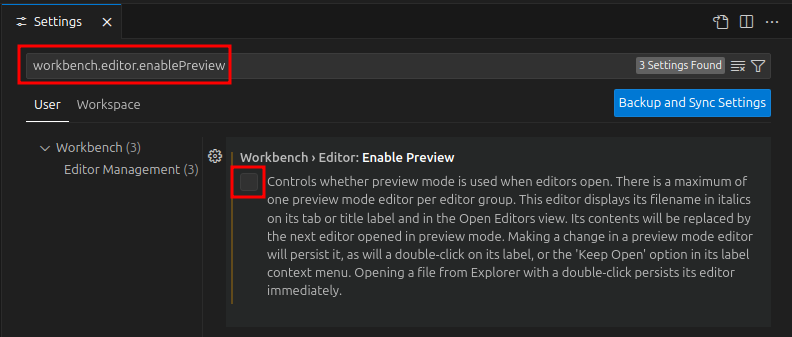

# How To Force VS Code To Open Files In A New Tab

To force VS Code to open every file in a new tab (instead of reusing the same preview tab), you need to disable preview mode. Here’s how:

## Step 1 - Open Command Palette

- Open Command Palette: `Ctrl+Shift+P`

## Step 2 - Open Settings

- Type and select: `Preferences: Open Settings (UI)`

## Step 3 - enablePreview

- Search for: workbench.editor.enablePreview

- Uncheck setting `Workbench › Editor: Enable Preview`

- This ensures every file opens in a dedicated tab instead of reusing a single preview tab.