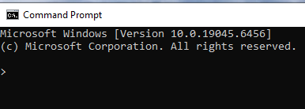

# How To Hide Address In Prompt On Windows


## Introduction

The default terminal prompt on Windows shows the current directory (e.g., `c:\users\harry`). However, when creating tutorials, sharing screenshots, or simply aiming for a more minimalist look, you might prefer to hide this information.


In this tutorial we will hide the address in the command prompt. 

## In this tutorial we will hide the address in the command prompt. 

To set the command prompt to a custom prompt of ">" greater-than sign character, enter the command.

```bash
prompt $g
```


## Perminatly create custom prompt

If you want the custom prompt to apply automatically when you start a command prompt, you can set the PROMPT environment variable.

```bash
setx PROMPT $g
```


On the next launch of the command prompt, you'll see your new prompt.



## Releated links

- [https://superuser.com/questions/315354/how-do-i-hide-the-path-in-command-line-prompt-on-windows](https://superuser.com/questions/315354/how-do-i-hide-the-path-in-command-line-prompt-on-windows)


