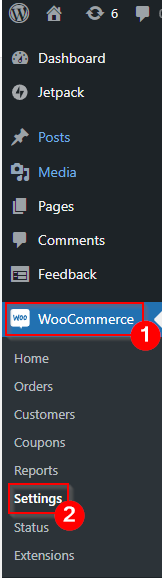
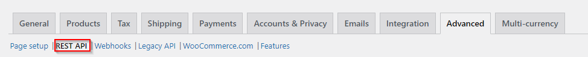
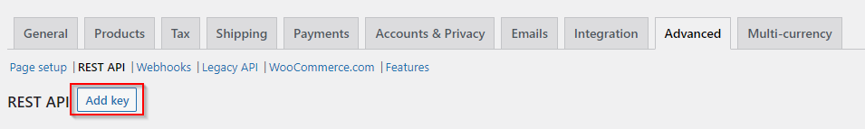

## Introduction

The WooCommerce Consumer Key and Secret enable external application to communicate with your WooCommerce store. The key and secret are an essential for authenticating requests to your WooCommerce store's REST API.

## Step by Step Guide

To obtain the `consumer_key` and `consumer_secret` for your WooCommerce store, you'll need to create a set of API credentials. Here's how you can do it:

1. **Access Your WooCommerce Dashboard**: Log in to your WordPress admin dashboard where WooCommerce is installed.

3. **Navigate to WooCommerce Settings**: In your WordPress admin, go to WooCommerce **settings**. You can usually find this under the **WooCommerce** tab in your WordPress sidebar.  
    

5. **Go to the Advanced Tab**: In the WooCommerce settings, click on the **Advanced** tab.  
    

7. **Enable the REST API**: Scroll down to the "REST API" section and make sure it's enabled. If it's not enabled, click the checkbox to enable it.

9. **Create a New API Key**: After enabling the REST API, you will see a new section called "REST API." Click on it.  
    

11. **Add a New Key**: Click **Add Key** button.  
     

13. **Configure Your Key**:
     - **Description**: Give your key a name or description so you can recognize it later.
     
     - **User**: Select your WordPress user account.
     
     - **Permissions**: Choose the level of permissions you want for this API key. For API requests like creating products, "Read/Write" permissions are typically needed.

15. **Generate Key**: After configuring the key details, click on "Generate API Key."  
     

17. **View Your Credentials**: Once the key is generated, you will see your `consumer_key` and `consumer_secret`. These are the credentials you will use in your Python script to authenticate with the WooCommerce REST API.**Important**: Make sure to copy and save your `consumer_key` and `consumer_secret` in a secure location. You won't be able to view the `consumer_secret` again, so if you lose it, you'll need to regenerate the API key.

## Summary

Once you have your `consumer_key` and `consumer_secret`, you can use them in your external applications to make authenticated requests to your WooCommerce store's REST API.
