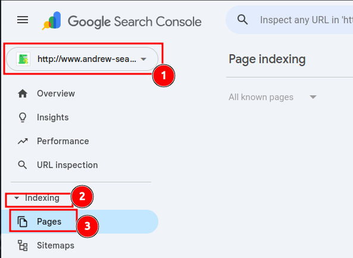

# Statistics Collection Procedure

## Google Search Console

### Performance

- [Google Search Console](https://search.google.com/u/1/search-console?resource_id=http%3A%2F%2Fwww.andrew-seaford.co.uk%2F)
- Click Andrew-Seaford.co.uk > Overview > Full Report

- Click Export > Download CSV

- Copy the zip file to `/home/andrew/Code/andrew-seaford.co.uk/experiments/Google Search Console - Performance`

### Page Indexing

- [Google Search Console](https://search.google.com/u/1/search-console?resource_id=http%3A%2F%2Fwww.andrew-seaford.co.uk%2F)
- Click Andrew-Seaford.co.uk > Indexing > Pages

- Click Export > Download CSV

- Copy the zip file to `/home/andrew/Code/andrew-seaford.co.uk/experiments/Google Search Console - Page Indexing`
