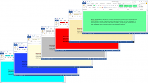
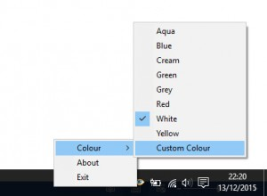

## What is Meares-Irlen Syndrome

Meares-Irlen Syndrome, (also known as Scotopic Sensitivity Syndrome or Visual Stress) is the term used to describe a number of symptoms which make reading difficult and often unpleasant.

## How can Oculus help?

The Oculus application helps people, both adults and children, by adjusting the default Window's white background colour to a colour which is more pleasant for reading.

Oculus is easy to use program with eight predefined colours and a colour picker which will allow you to pick any one of 16 million colours.  Oculus is compatible with the following programs on Windows 7 and Windows 10  - MicroSoft Word - MicroSoft Excel - MicroSoft Outlook - Notepad - Wordpad

   |

## Download

- Download [SetupOculus1.0.0.0.exe](http://www.andrew-seaford.co.uk/download/oculus/SetupOculus1.0.0.0.exe)
- User Manual [OculusUserManual.pdf](http://www.andrew-seaford.co.uk/download/oculus/OculusUserManual.pdf)

## Related Links

- [http://www.colour2c.co.uk](http://www.colour2c.co.uk) The Dyslexia and Coloured Filter Service works in North Yorkshire Schools assessing pupils for Meares-Irlen Syndrome and prescribing coloured overlays.
