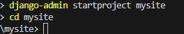
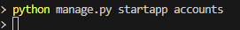

# Creating a Django Site With User Authentication

This tutorial explains how to create a Django web application with user authentication, including public and restricted areas, user creation, login, password reset, password change, and user removal.

## Prerequisites

- Python installed (>= 3.8)

- Django installed (>= 4.x)

## 1. Setting Up the Django Project

- Install Django

```bash
pip install django
```

- Create the Project

```bash
django-admin startproject mysite
cd mysite
```



- Create the App

```bash
python manage.py startapp accounts
```



- Add the app to INSTALLED_APPS in mysite/settings.py

```python
INSTALLED_APPS = [
    ...
    'accounts',
    'django.contrib.sites',
]
```

- Also, set the `LOGIN_URL` and `LOGIN_REDIRECT_URL` in `settings.py`

```python
LOGIN_URL = '/accounts/login/'
LOGIN_REDIRECT_URL = '/restricted/'
```

## 2. Create the User Authentication Views

- Define URLS in `accounts/urls.py`

```python
from django.urls import path
from django.contrib.auth import views as auth_views
from . import views

urlpatterns = [
    path('signup/', views.signup, name='signup'),
    path('login/', auth_views.LoginView.as_view(), name='login'),
    path('logout/', auth_views.LogoutView.as_view(), name='logout'),
    path('password_reset/', auth_views.PasswordResetView.as_view(), name='password_reset'),
    path('password_reset/done/', auth_views.PasswordResetDoneView.as_view(), name='password_reset_done'),
    path('reset/<uidb64>/<token>/', auth_views.PasswordResetConfirmView.as_view(), name='password_reset_confirm'),
    path('reset/done/', auth_views.PasswordResetCompleteView.as_view(), name='password_reset_complete'),
    path('password_change/', auth_views.PasswordChangeView.as_view(), name='password_change'),
    path('password_change/done/', auth_views.PasswordChangeDoneView.as_view(), name='password_change_done'),
]
```

- Create views in `account/views.py`

```python
from django.contrib.auth.forms import UserCreationForm
from django.shortcuts import render, redirect

def signup(request):
    if request.method == 'POST':
        form = UserCreationForm(request.POST)
        if form.is_valid():
            form.save()
            return redirect('login')
    else:
        form = UserCreationForm()
    return render(request, 'registration/signup.html', {'form': form})
```

## 3 Templates

Create the templates in the accounts app `mysite\accounts\templates`.

## 4. Restricted Area

- Protect views by adding `@login_required` in the `view.py`

```python
@login_required
def restricted(request):
    return render(request, 'restricted/restricted.html')  
```

- Create the restricted page `\mysite\accounts\templates\restricted\restricted.html`

```html
<h2>Restricted</h2>
<p>This is a restricted area only logged in user can access this page</p>


<form action="" method="post">
    
    <button type="submit">Logout</button>
</form>
```


## 5 - Testing

- Start the server

```bash
python manage.py runserver
```

- Navigate to the restricted page <http://127.0.0.1:8000/accounts/restricted/> and confirm that you can not access the restricted page.
- Create an account at the sign up page <http://127.0.0.1:8000/accounts/signup/>
- Log in using your username and password <http://127.0.0.1:8000/accounts/login/>
