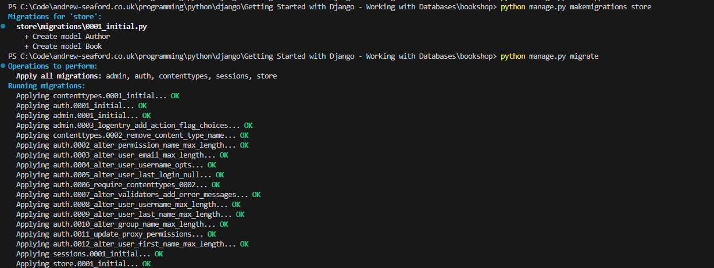

# Getting Started with Django - Working with Databases

Django is a powerful web framework that makes it easy to work with databases using its built-in ORM (Object-Relational Mapping) system. In this guide, we'll walk through database operations for a bookshop application, covering table creation, data insertion, querying, deletion, and modification.

## 1. Setting Up Django and the Database

- Before working with the database, ensure you have Django installed:

```bash
pip install django
```

- Create a new Django project:

```bash
django-admin startproject bookshop
cd bookshop
python manage.py startapp store
```

- Register the app in bookshop/settings.py:

```python
INSTALLED_APPS = [
    'django.contrib.admin',
    'django.contrib.auth',
    'django.contrib.contenttypes',
    'django.contrib.sessions',
    'django.contrib.messages',
    'django.contrib.staticfiles',
    'store',  # Our new app
]
```

## 2. Creating Tables (Models)

Django uses models to define database tables. In store/models.py, define models for books and authors:

```python
from django.db import models

class Author(models.Model):
    name = models.CharField(max_length=255)
    birth_date = models.DateField()

    def __str__(self):
        return self.name

class Book(models.Model):
    title = models.CharField(max_length=255)
    publication_date = models.DateField()
    author = models.ForeignKey(Author, on_delete=models.CASCADE)

    def __str__(self):
        return self.title
```

- Apply migrations to create the tables in the database:

```bash
python manage.py makemigrations store
python manage.py migrate
```



## 3. Inserting Data

- To insert data, use Django's shell:

```bash
python manage.py shell
```

- Inside the shell:

```bash
from store.models import Author, Book
from datetime import date
```

### Create an author

```python
author = Author.objects.create(name="J.K. Rowling", birth_date=date(1965, 7, 31))
```

### Create a book

```python
book = Book.objects.create(title="Harry Potter and the Sorcerer's Stone", publication_date=date(1997, 6, 26), author=author)
```

## 4. Querying Data

Querying a Single Table

### Get all books

```python
books = Book.objects.all()
for b in books:
    print(b)
```


### Get a specific book by title

```python
book = Book.objects.get(title="Harry Potter and the Sorcerer's Stone")
print(book)
```


### Querying with Joins (Multiple Tables)

- Get books by a specific author

```python
books_by_rowling = Book.objects.filter(author__name="J.K. Rowling")
for b in books_by_rowling:
    print(b)
```


## 5. Updating Data

To update a record, such as changing an author's date of birth:

```python
. Updating Data

To update a record, such as changing an author's date of birth:
```

## 6. Deleting Data

### Delete a book

```python
book = Book.objects.get(title="Harry Potter and the Sorcerer's Stone")
book.delete()
```


### Delete an author (also deletes related books due to on_delete=models.CASCADE)

```python
author = Author.objects.get(name="J.K. Rowling")
author.delete()
```


## 7. Modifying a Table

- To add a new column, update the model in store/models.py:

```python
class Book(models.Model):
    title = models.CharField(max_length=255)
    publication_date = models.DateField()
    author = models.ForeignKey(Author, on_delete=models.CASCADE)
    genre = models.CharField(max_length=100, default='')  # New column
```

- Apply the migration:

```bash
python manage.py makemigrations store
python manage.py migrate
```


## 8. Data Types in Django Models

Apart from CharField, Django provides various data types for models:

IntegerField – Stores integer values.

FloatField – Stores floating-point numbers.

BooleanField – Stores True/False values.

DateTimeField – Stores date and time.

TextField – Stores large text data.

EmailField – Stores email addresses with validation.

URLField – Stores URLs.

SlugField – Stores short labels with letters, numbers, underscores, and hyphens.

FileField – Stores uploaded files.

ImageField – Stores uploaded images.

## Conclusion

In this guide, we covered creating tables, inserting data, querying data, deleting records, and modifying tables in a Django application. Using Django's ORM simplifies working with databases while maintaining flexibility and efficiency.
