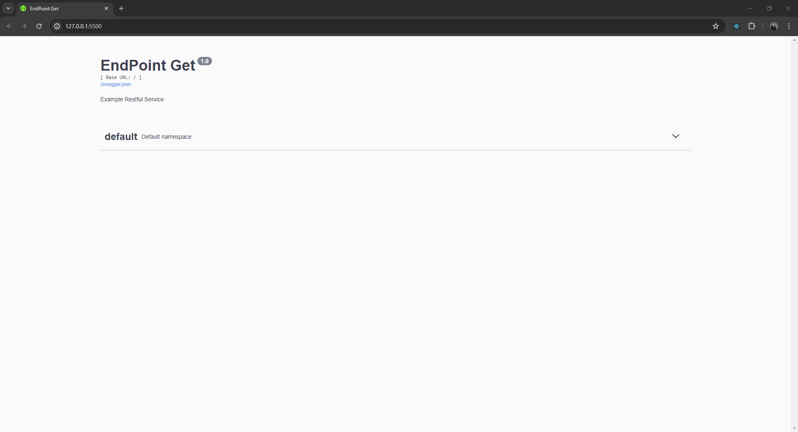
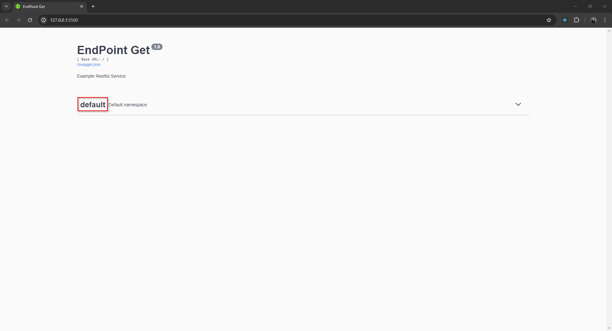
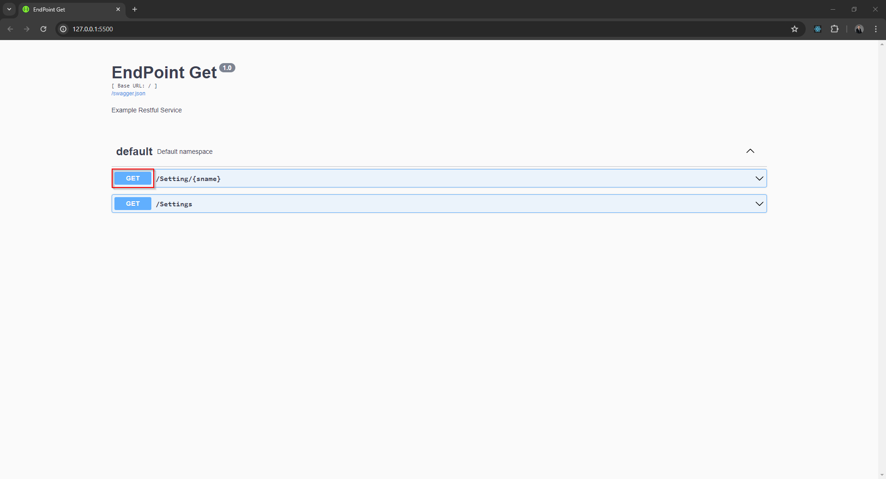
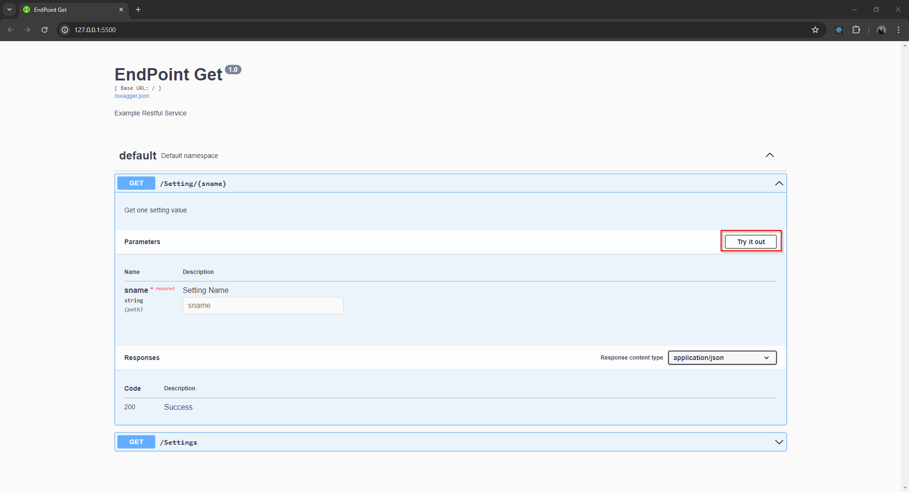
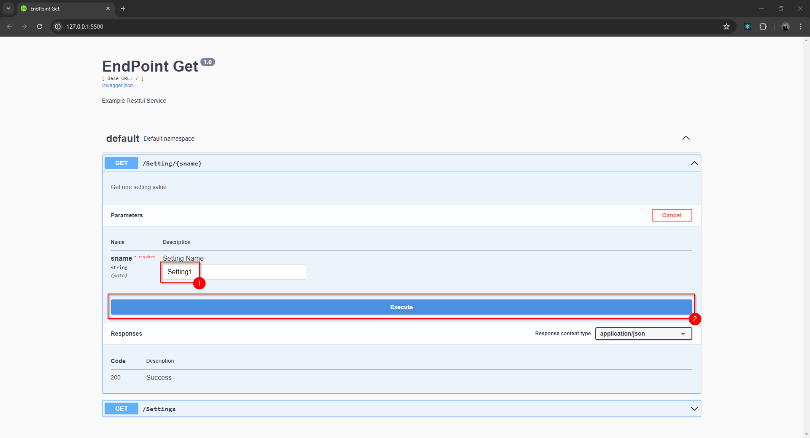
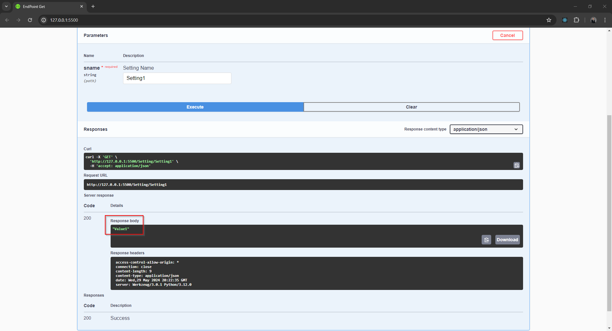
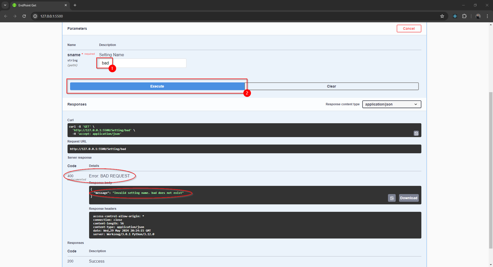

# How To Unit Test a Flask Restful Get Endpoint With A Parameter Using Python

In this article, we are going to explore how to unit test a simple restful endpoint using Python 3 and the modules Flask, Flask_restx, and UnitTest. The test will focus on testing an endpoint that has a parameter for specifying the name of the required setting.

## Creating The Application

First, we are going to create a simple flask application, the application will host a GET endpoint called */Setting/{sname}* that returns the value for a single setting.

- Create a text file called `endPointGet.py` and add the following code.

```python
from flask import Flask
from flask_restx import Resource, Api
from flask_cors import CORS

app = Flask(__name__)
CORS(app)  # Allow CORS for all routes
api = Api(app, version='1.0', title='EndPoint Get', description='Example Restful Service')

mySettingsData = [
            {'Name': 'Setting1', 'Value': 'Value1'},
            {'Name': 'Setting2', 'Value': 'Value2'}
        ]

def getSettingValue(sname):
    for setting in mySettingsData:
        if setting['Name'] == sname:
            return setting['Value']
    return None

@api.route('/Settings', doc={"description": "Get all settings"})
class GetSettings(Resource):
    def get(self):
        return mySettingsData

@api.route('/Setting/<string:sname>', doc={"description": "Get one setting value"})
@api.param('sname', 'Setting Name')
class GetSetting(Resource):
    def get(self, sname):
        value = getSettingValue(sname)
        if value == None:
            return {'message': f'Invalid setting name. {sname} does not exist'}, 400
        else:
            return value
        
if __name__ == '__main__':
    app.run(host='0.0.0.0', port=5500, debug=False)
```

## Running The Application

To run the application:

- From the terminal execute the python file.
`python endPointGet.py`


- Open a web browser and navigate to http://127.0.0.1:5500, the page will show the swagger document for the Flask application.


- Click *default* to expand the list of endpoints


- Click the *GET* button next to /Setting/{sname}.


- Click the *Try it out* button.


- Enter the name of the setting into sname and then click the *Execute* button.


- The value of the setting will be displayed in the *Response Body*


- Entering a setting name that does not exist will result in an error code 400.



## Unit Testing The Application

The unit test will test two scenarios when the setting name exists and when the setting name does not exist. To unit test the flask application:

- Create a text file called endPointGetTests.py and add the following code

```python
import unittest
import json
from endPointGet import *

class SystemSettingsTestCase(unittest.TestCase):
    def setUp(self):
        """Set up for unit tests, function is executed before tests begin"""

        self.client = app.test_client()
        app.config['TESTING'] = True

    def test_get_setting(self):
        """Test confirms that GET /Setting/{sname} will return a setting value"""

        # Arrange
        expected_result = 'Value1'

        # Act
        response = self.client.get('/Setting/Setting1') # Make a GET request to the /Setting/{sname} endpoint
        
        # Assert
        self.assertEqual(response.status_code, 200) # Check that the response status code is 200 OK
        actual_result = json.loads(response.data) # Parse the JSON response
        self.assertEqual(actual_result, expected_result) # Check that the response contains the expected data

    def test_get_setting_bad_setting_name(self):
        """Test confirms that GET /Setting/{sname} will return 400 when the setting name does not exisit"""

        # Arrange
        sname = 'Bad_Setting_Name'
        expected_message = f'Invalid setting name. {sname} does not exist'

        # Act
        response = self.client.get(f'/Setting/{sname}') # Make a GET request to the /Settings endpoint
        
        # Assert
        self.assertEqual(response.status_code, 400) # Check that the response status code is 400 BAD
        self.assertEqual(response.status, '400 BAD REQUEST') # Check the response status message        
        response_json = response.get_json() # Extract the JSON data from the response    
        self.assertIn('message', response_json) # Ensure the 'message' key is in the response
        self.assertEqual(response_json['message'], expected_message) # Check that the response message contains the expected message

if __name__ == '__main__':
    unittest.main()
```

- To run the test, execute the Python file endPointGetTests.py from the terminal.

`python endPointGetTests.py`

- The log messages from a successful test will end with *OK*.
