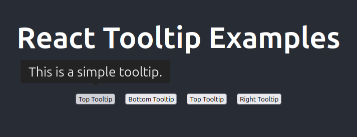
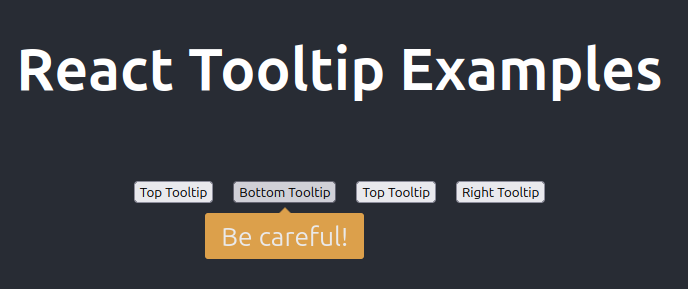
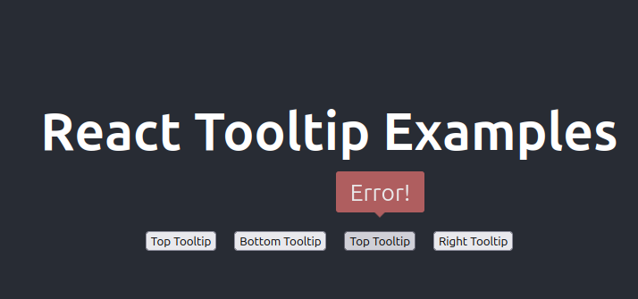
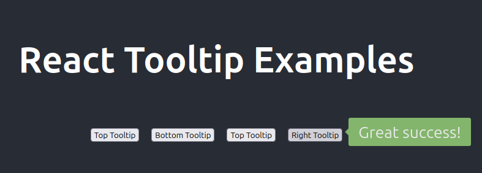

# A Simple Guide to Using react-tooltip

This tutorial provides a step-by-step guide to integrating the popular react-tooltip library into a standard React application.

## Step 1: Set Up Your React Project

First, you'll need a React application. If you don't have one, you can quickly create one using Create React App:

```bash
npx create-react-app my-tooltip-app
cd my-tooltip-app
```

Once your project is ready, you can install the react-tooltip package.

## Step 2: Install react-tooltip

Open your terminal in the project directory and run the following command:

```bash
npm install react-tooltip
```

This will add the package to your project's dependencies.

## Step 3: Basic Implementation

Using react-tooltip involves two main parts:

    The Anchor Element: This is the element you want the tooltip to appear on when you hover over it (e.g., a button, a link, or an icon).

    The Tooltip Component: This is a component provided by the library that you include once in your application layout. It listens for hovers on any anchor elements and displays the appropriate tooltip.

Let's modify the src/App.js file to see how this works.

Import the component and its CSS: At the top of src/App.js, add the following lines:

```js
import { Tooltip } from 'react-tooltip'
import 'react-tooltip/dist/react-tooltip.css'
```

Create an anchor element: This is a standard HTML element with two special data attributes:

    data-tooltip-id: This is a unique identifier that connects the anchor to the Tooltip component.

    data-tooltip-content: This is the text that will appear inside the tooltip.

Add the Tooltip component: Place the <Tooltip /> component somewhere in your JSX, making sure its id prop matches the data-tooltip-id from your anchor element. It's best practice to place this once near the root of your component tree.

Here is a complete src/App.js example for a basic setup:

```js
import React from 'react';
import { Tooltip } from 'react-tooltip';
import 'react-tooltip/dist/react-tooltip.css'; // Don't forget to import the CSS
import './App.css';

function App() {
  return (
    <div className="App">
      <header className="App-header">
        <h1>React Tooltip Example</h1>
        <p>Hover over the button below to see the tooltip in action!</p>
        
        {/* 1. The ANCHOR element */}
        <a
          data-tooltip-id="my-tooltip"
          data-tooltip-content="Hello world! I'm a tooltip."
        >
          <button style={{ padding: '10px 20px', fontSize: '16px' }}>
              Hover over me
          </button>
        </a>

        {/* 2. The TOOLTIP component */}
        <Tooltip id="my-tooltip" />

      </header>
    </div>
  );
}

export default App;
```

## Step 4: Customizing the Tooltip

The library offers many easy-to-use props for customization. You just add them to the <Tooltip /> component.

    place: Change the position ('top', 'right', 'bottom', 'left').

    variant: Change the color theme ('dark', 'light', 'success', 'warning', 'error').

    effect: Change the animation ('solid', 'float').

Let's update our App.js to include some customized tooltips.

```js
import React from 'react';
import { Tooltip } from 'react-tooltip';
import 'react-tooltip/dist/react-tooltip.css';
import './App.css';

function App() {
  return (
    <div className="App">
      <header className="App-header">
        <h1>React Tooltip Examples</h1>
        <div style={{ display: 'flex', gap: '20px', marginTop: '30px' }}>

          {/* Example 1: Basic Tooltip (Top) */}
          <a data-tooltip-id="my-tooltip-1" data-tooltip-content="This is a simple tooltip.">
            <button>Top Tooltip</button>
          </a>          

          {/* Example 2: Warning Tooltip (Bottom) */}
          <a data-tooltip-id="my-tooltip-2" data-tooltip-content="Be careful!">
            <button>Bottom Tooltip</button>
          </a>

          {/* Example 3: Error Tooltip (Top) */}
          <a data-tooltip-id="my-tooltip-3" data-tooltip-content="Error!">
            <button>Top Tooltip</button>
          </a>

          {/* Example 4: Success Tooltip (Right) */}
          <a data-tooltip-id="my-tooltip-4" data-tooltip-content="Great success!">
            <button>Right Tooltip</button>
          </a>

        </div>

        {/* Tooltip Components */}
        <Tooltip id="my-tooltip-1" place="top" effect="solid" />
        <Tooltip id="my-tooltip-2" place="bottom" variant="warning" effect="float" />
        <Tooltip id="my-tooltip-3" place="top" variant="error" />
        <Tooltip id="my-tooltip-4" place="right" variant="success" />

      </header>
    </div>
  );
}

export default App;
```

Now, when you run your app (npm start), you'll see four different buttons, each with its own styled and positioned tooltip on hover.







