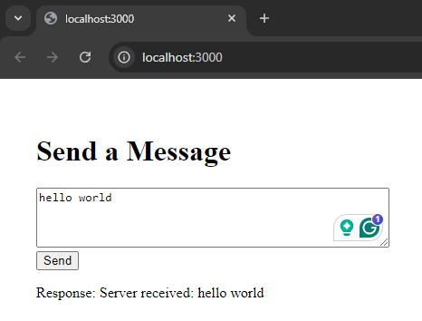

# How to  Handle Server-side API Routes in React

## Introduction

In a React app, users can inspect the page's HTML and read the JavaScript code, though with some limitations.

### HTML

React generates HTML elements dynamically in the browser based on the current state of the app. Users can inspect the final HTML that React renders by using browser developer tools (like Chrome DevTools). This HTML will not directly show React components, but rather the output DOM elements (e.g., div, button, etc.) that React generates.

### JavaScript

JavaScript Code: The JavaScript code from a React app is usually bundled (with tools like Webpack or Vite) and minified for production. Even though it is bundled and minified, users can still access the JavaScript by inspecting the source files in the browser developer tools. However, the code might be harder to read because minification and bundling obfuscate variable names and split the code across many files.

React Components: The original component code (like JSX syntax) isn't visible to users. Instead, they will see the compiled JavaScript that React produces after the build process. Although, with proper tooling or reverse engineering, users can understand the functionality of the app.

To protect sensitive logic, it's important not to include secrets or critical business logic on the client-side JavaScript, as users can always access client-side code. Sensitive operations should always be handled server-side.

## Hiding Secrets Within Routes

It is possible to handle server-side API routes within a React project, especially if you are using Next.js, which is a React framework that allows you to write server-side code alongside your client-side code. In Next.js, API routes are server-side endpoints defined within the app that can be used to handle things like form submissions, API requests, and more. These API routes are hidden from the client since they run server-side.

Here’s how you can hide a POST request in Next.js inside a route like pages/api/chat.js.

### 1. Setup a Next.js App

First, create a new Next.js app

```bash
npx create-next-app@latest my-nextjs-app
cd my-nextjs-app
```

### 2. Create the API Route

In Next.js, you can create API routes by placing files in the /pages/api directory. These files will automatically be treated as server-side routes.

Here’s an example where we create an API route for /api/chat that accepts POST requests. This route will only respond to POST requests. The route accepts a text parameter from the request body, processes it, and returns a JSON response.

Create a new file at `/pages/api/chat.js`  (API Route in Next.js)

```js
export default async function handler(req, res) {
  if (req.method === 'POST') {
    const { text } = req.body;

    if (text) {
      // Simulate processing the request
      // TODO: Add secure post request here
      res.status(200).json({ message: `Server received: ${text}` });
    } else {
      res.status(400).json({ error: 'Text is required' });
    }
  } else {
    // Handle any other HTTP method
    res.setHeader('Allow', ['POST']);
    res.status(405).end(`Method ${req.method} Not Allowed`);
  }
}
```

### 3. Create the Frontend Form

In your Next.js app, create a form in the main page to send a POST request to the /api/chat endpoint.

Create a new file at `/pages/index.js` (Frontend Form)

```js
import { useState } from 'react';

export default function Home() {
  const [text, setText] = useState('');
  const [response, setResponse] = useState('');

  const handleSubmit = async () => {
    try {
      const res = await fetch('/api/chat', {
        method: 'POST',
        headers: {
          'Content-Type': 'application/json',
        },
        body: JSON.stringify({ text }),
      });

      const data = await res.json();
      setResponse(data.message || data.error);
    } catch (error) {
      setResponse('An error occurred.');
    }
  };

  return (
    <div style={{ padding: '2rem' }}>
      <h1>Send a Message</h1>
      <textarea
        value={text}
        onChange={(e) => setText(e.target.value)}
        placeholder="Enter your message here"
        rows="4"
        cols="50"
      />
      <br />
      <button onClick={handleSubmit}>Send</button>
      {response && <p>Response: {response}</p>}
    </div>
  );
}
```

### 4. Remove app/pages.js

To avoid a conflict between `/pages/index.js` and `/app/pages.js`. Delete `/app/pages.js` file.

### 5. Run the Next.js App

Now, run your Next.js app

```bash
npm run dev
```

The app will be available at http://localhost:3000.

The application will ask for a message


Enter a message and then click the submit button.

After clicking the sumbit button, the app will make a request to the backend `pages/api/chat.js`, the following code from chat.js simulates making a secure post request and responds with the "server received".

```js
if (text) {
// Simulate processing the request
// TODO: Add secure post request here
res.status(200).json({ message: `Server received: ${text}` });
```



## Explanation

Backend (API Route): The API route /api/chat defined in pages/api/chat.js runs on the server side. When the frontend makes a request to /api/chat, it triggers the server-side code to process the request and send back a response.

Frontend (Form): The form in pages/index.js allows the user to enter some text. When the user clicks "Send", it sends the text to the server-side API route using the fetch API, and the response is displayed on the page.

## Why This is Secure

Server-Side API Route: The server-side code (/pages/api/chat.js) runs in Node.js on the server, and it is never exposed to the client. This is because all code inside /pages/api is only executed on the server.

Separation of Concerns: The client (React components) only knows about the API route, not the server-side implementation. This ensures that any sensitive logic or data processing is hidden from the client-side.

Folder Structure:

```bash
my-nextjs-app
├── pages
│   ├── api
│   │   └── chat.js      # API route for handling POST requests
│   └── index.js         # Frontend form
├── public
├── styles
├── package.json
├── next.config.js
```

With this approach, you have successfully hidden your server-side logic inside the API route in Next.js, which ensures that sensitive operations like POST requests and form submissions are handled securely and aren't visible to users on the client side.
