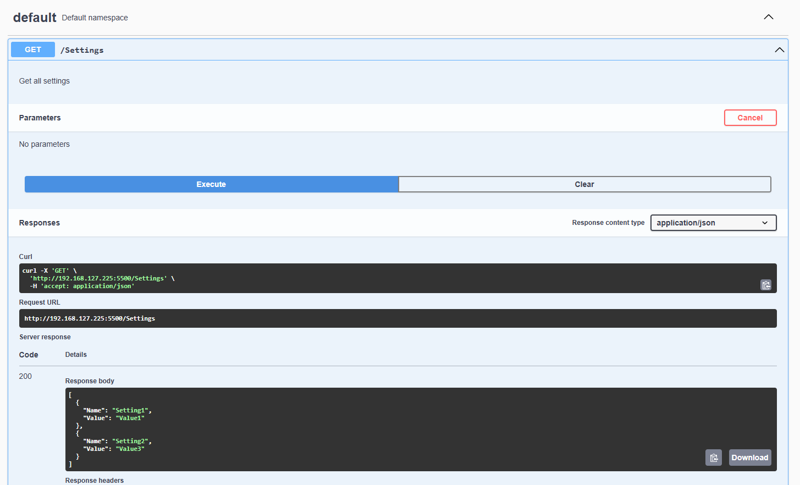

# How To Containerize A Python Flask App

In this article, we will create a Docker container for a python flask app that serves a Restful GET endpoint.

## Preparation

- Create a requirements file for install the required pip packages. Create a text file called `requirements.txt`

```bash
flask
flask_restx
install flask_cors
```

- Execute the command from the command prompt to install the package requirements

```bash
pip install -r requirements.txt
```

- Create test app, called app.py
[app.py](app.py)

- Test App by executing the app from the command prompt.

```bash
python3 app.py 
```

- Open a web browser and navigate to http://127.0.0.1:5500. Use the swagger page to confirm the application is working as expected. In this simple app, executing the get will display a JSON list of settings.



## Containerizing The App

- Create a Dockerfile in the same directory as your app.py file

[Dockerfile](Dockerfile)

- Create a .dockerignore file to avoid unnecessary files being copied to the container

[.dockerignore](.dockerignore)

- Run the following command in the directory containing the Dockerfile to build the Docker image

```bash
docker build -t flask-app .
```

- Run the container based on the image

```bash
docker run -d -p 5500:5500 --name flask-container flask-app
```

- Open a web browser and navigate to http://127.0.0.1:5500. Use the swagger page to confirm the application is working as expected.
