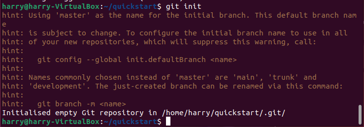
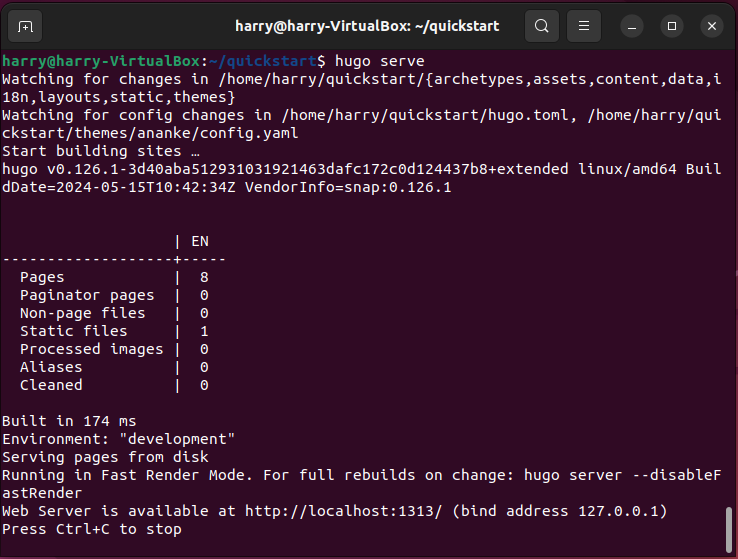
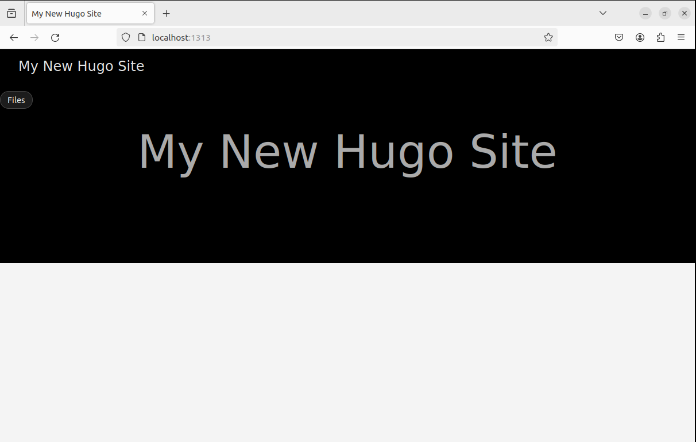
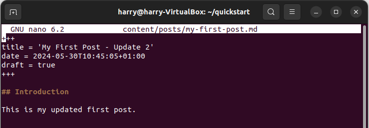
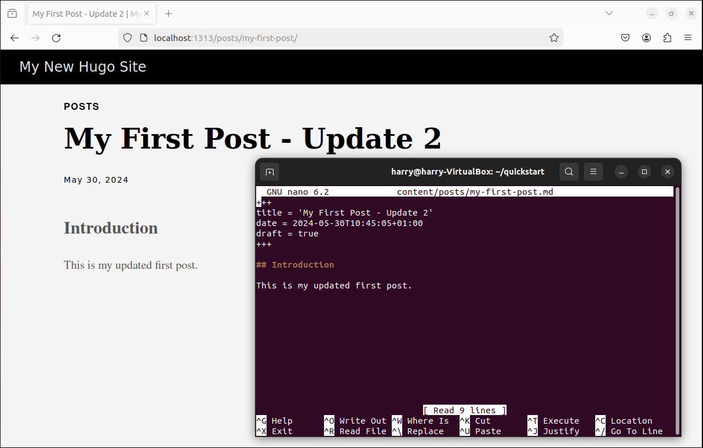

# Installing Hugo on Ubuntu

In this guide, we are going to install Hugo on a server running Ubuntu version 22.04.

## Installation

- Install hugo `sudo snap install hugo`

- Install GIT `sudo apt-get install git-all`

- Confirm Hugo is installed by checking the version number `hugo version`

## Creating First Website

- Create a new site called *quickstart* `hugo new site quickstart`

- Change directory `cd quickstart`

- Start a GIT repository `git init`

- Clone the Ananke theme into the themes directory, adding it to your project as a Git submodule. `git submodule add https://github.com/theNewDynamic/gohugo-theme-ananke.git themes/ananke`

- Append a line to the site configuration file, indicating the current theme. `echo "theme = 'ananke'" >> hugo.toml`

- Start Hugo’s development server to view the site. `hugo serve`

- Using a web browser navigate to the locally hosted website <http://localhost:1313>.
>

## Creating First Post

- To create a new post, run the command `hugo new content posts/my-first-post.md`. The command will create a new file in the directory `content\posts`

- Edit the new file using a text editor `nano content\posts\my-first-post.md`

- Change the draft=false to draft=true in the header section. Then add some markdown content to the file. To save the changes press `control + o` to exit press `control + x`.

- Using a web browser navigate to page http://localhost:1313/posts/my-first-post/

## Deploying

- `hugo --gc --minify`
- `rclone sync --interactive --sftp-host sftp.example.com --sftp-user www-data --sftp-ask-password public/ :sftp:www/`

## Theme

- <https://themes.gohugo.io/themes/hugo-flex/>
- <https://github.com/adityatelange/hugo-PaperMod/wiki/Installation>
- <https://aakinshin.net/perfology/>

## Related Sources

- <https://gohugo.io/installation/linux/>
- <https://git-scm.com/book/en/v2/Getting-Started-Installing-Git>
- <https://gohugo.io/getting-started/quick-start/>
- <https://gohugo.io/hosting-and-deployment/deployment-with-rclone/>
- <https://gohugo.io/hosting-and-deployment/deployment-with-rclone/>
