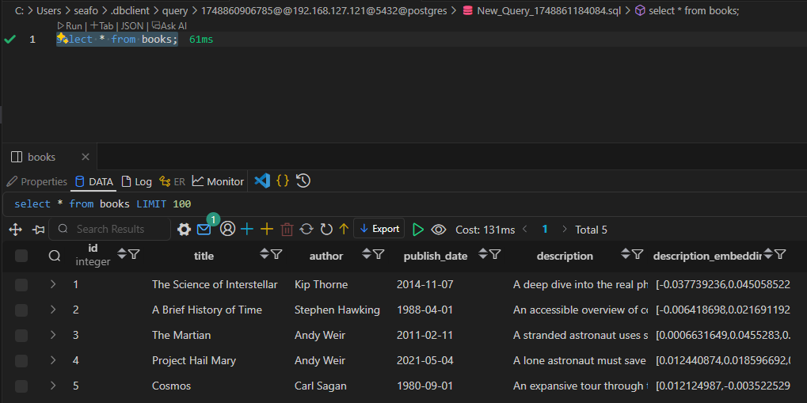

# How To Perform a Vector Search in A Postgres Database using pgvector

### Step 1: Create the Table

```sql
CREATE EXTENSION IF NOT EXISTS vector;

CREATE TABLE books (
    id SERIAL PRIMARY KEY,
    title TEXT NOT NULL,
    author TEXT NOT NULL,
    publish_date DATE NOT NULL,
    description TEXT NOT NULL,
    description_embedding VECTOR(1536) -- assuming 1536 dimensions (e.g. OpenAI)
);
```

### Step 2: Insert Sample Data

We'll insert:

title, author, publish_date, description

The book description embedding will be added later.

Here's example SQL with 5 books:

```sql
INSERT INTO books (title, author, publish_date, description)
VALUES 
(
    'The Science of Interstellar',
    'Kip Thorne',
    '2014-11-07',
    'A deep dive into the real physics behind the science fiction film Interstellar.'
),
(
    'A Brief History of Time',
    'Stephen Hawking',
    '1988-04-01',
    'An accessible overview of cosmology, black holes, and the nature of time.'
),
(
    'The Martian',
    'Andy Weir',
    '2011-02-11',
    'A stranded astronaut uses science and wit to survive on Mars.'
),
(
    'Project Hail Mary',
    'Andy Weir',
    '2021-05-04',
    'A lone astronaut must save humanity from an extinction-level threat using science and clever engineering.'
),
(
    'Cosmos',
    'Carl Sagan',
    '1980-09-01',
    'An expansive tour through the universe and human understanding of the cosmos.'
);

```

### Step 3: Run Queries

- Execute a Standard SQL query (find books after 2010)

```sql
SELECT * FROM books
WHERE publish_date > '2010-01-01'
ORDER BY publish_date;
```

id|title|author|publish_date|description|description_embedding
-|-|-|-|-|-
3|The Martian|Andy Weir|2011-02-11|A stranded astronaut uses science and wit to survive on Mars.|
1|The Science of Interstellar|Kip Thorne|2014-11-07|A deep dive into the real physics behind the science fiction film Interstellar.|
4|Project Hail Mary|Andy Weir|2021-05-04|A lone astronaut must save humanity from an extinction-level threat using science and clever engineering.|

(3 rows)

### Step 4: Update Embeddings with Python

- Install requirements

```bash
pip install openai psycopg2-binary python-dotenv
```

- Create a .env file for the sensitive data

```ini
# .env

OPENAI_API_KEY=your-openai-api-key

DB_NAME=your_db_name
DB_USER=your_db_user
DB_PASSWORD=your_db_password
DB_HOST=localhost
DB_PORT=5432
```

- Create a python script [bookshop-embedding.py](bookshop-embedding.py)

- Execute the python script

```bash
python3 bookshop-embedding.py
```

- Script output

```log
✅ Updated book ID 1
✅ Updated book ID 2
✅ Updated book ID 3
✅ Updated book ID 4
✅ Updated book ID 5
```

- Book database table with data.

```sql
select * from books;
```



### Step 5: Vector search

- Vector similarity search (find books with similar descriptions). The search requires the search term to be converted into a vector. The `::vector` cast tells PostgreSQL to interpret the Python list (which arrives as a numeric[]) as a proper vector type for similarity search.

```sql
SELECT title, author, description_embedding <-> %s::vector AS distance
FROM books
ORDER BY distance ASC
LIMIT 5;
```

- Create a python script [bookshop-vectorsearch.py](bookshop-vectorsearch.py)

- Execute the python script

```bash
python3 bookshop-vectorsearch.py
```

- Script output

```log
Title: The Martian, Author: Andy Weir, Distance: 0.8516
Title: Project Hail Mary, Author: Andy Weir, Distance: 0.9396
Title: The Science of Interstellar, Author: Kip Thorne, Distance: 1.0807
Title: A Brief History of Time, Author: Stephen Hawking, Distance: 1.1347
Title: Cosmos, Author: Carl Sagan, Distance: 1.1362
```