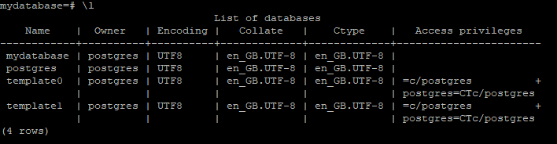
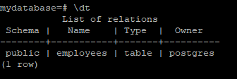

# How To Install PostgreSQL on Ubuntu

PostgreSQL is a powerful, open-source relational database management system used by developers worldwide. In this tutorial, I’ll walk you through the process of installing PostgreSQL on an Ubuntu system.

## Installation

To install PostgreSQL on Ubuntu, follow these steps:

- Install the PostgreSQL package

    ```bash
    sudo apt install postgresql postgresql-contrib
    ```

- Start the PostgreSQL service

    ```bash
    sudo systemctl start postgresql
    ```

- Enable PostgreSQL to start on boot

    ```bash
    sudo systemctl enable postgresql
    ```

- Switch to the PostgreSQL user

    ```bash
    sudo -i -u postgres
    ```

- Access the PostgreSQL prompt. Once in the PostgreSQL prompt, you can perform various database operations. To exit the prompt, type `\q`.

    ```bash
    psql
    ```

- In the PostgreSQL prompt, set the password for the postgres user

    ```sql
    ALTER USER postgres PASSWORD 'newpassword';
    ```

## Enable Remote Access

- To enable remote access edit the postgresql.conf file to listen on all IP addresses:

  - Open the postgresql.conf file in a text editor. This file is typically located in the `/etc/postgresql/[version]/main/` directory.

    ```bash
    sudo nano /etc/postgresql/[version]/main/postgresql.conf
    ```

  - Look for the *listen_addresses* setting and set it to '*':

    ```conf
    listen_addresses = '*'
    ```

  - Save and close the file.

- Edit the pg_hba.conf file to allow remote connections:

  - Open the pg_hba.conf file in a text editor. This file is also located in the /etc/postgresql/[version]/main/ directory.

    ```bash
    sudo nano /etc/postgresql/[version]/main/pg_hba.conf
    ```

  - Add the following line to the end of the file to allow connections from any IP address (replace 192.168.127.0/24 with your specific IP range or 0.0.0.0/0 to allow all IP addresses, though the latter is less secure):

    ```conf
    host    all             all             192.168.127.0/24          md5
    ```

  - Save and close the file.

- Restart the PostgreSQL service

    ```bash
    sudo systemctl restart postgresql
    ```

- Make sure that your firewall allows connections to port 5432

    ```bash
    sudo ufw allow 5432/tcp
    ```

## Create Test Database

Now lets create a quick test database to confirm everything is working as expected.

- Switch to the PostgreSQL user

    ```bash
    sudo -i -u postgres
    ```

- Access the PostgreSQL prompt. Once in the PostgreSQL prompt, you can perform various database operations. To exit the prompt, type `\q`.

    ```bash
    psql
    ```


- Create a new database

    ```bash
    createdb mydatabase
    ```

- Confirm the database has been created using the command `\l` to list databases.

    

- Connect to the database `\c mydatabase`

- Create a table

    ```sql
    CREATE TABLE employees (
        id SERIAL PRIMARY KEY,
        name VARCHAR(100),
        position VARCHAR(50),
        salary NUMERIC
    );
    ```

- Confirm the table was created using the command `\dt`

    

- Insert test data

    ```sql
    INSERT INTO employees (name, position, salary) VALUES ('John Doe', 'Manager', 60000);
    INSERT INTO employees (name, position, salary) VALUES ('Jane Smith', 'Developer', 55000);
    ```

- Execute a simple query

    ```sql
    SELECT * FROM employees;
    ```

    

## Connect To The Test Database Using Python

- Install the psycopg2 module

    ```bash
    pip install psycopg2-binary
    ```

- Create a python file `nano p.py`

    ```python
    import psycopg2

    # Database connection parameters
    db_params = {
        'dbname': 'mydatabase',
        'user': 'postgres',
        'password': 'yourpassword',
        'host': 'localhost',
        'port': '5432'
    }

    try:
        # Connect to the PostgreSQL database
        connection = psycopg2.connect(**db_params)
        cursor = connection.cursor()

        # Execute the query
        cursor.execute("SELECT * FROM employees;")
        
        # Fetch all the results
        rows = cursor.fetchall()

        # Print the results
        for row in rows:
            print(row)

    except (Exception, psycopg2.DatabaseError) as error:
        print(f"Error: {error}")
    finally:
        if connection:
            cursor.close()
            connection.close()
            print("PostgreSQL connection is closed")
    ```

- Execute the Python file

    ```bash
    python3 p.py
    ```

    
